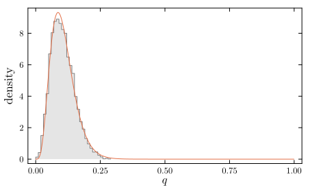
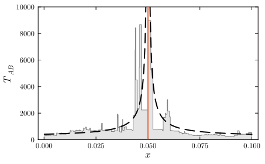

```@meta
EditURL = "docs/README.jl"
```

# Fwd

Forward population genetics simulation in julia, with tree sequence
recording. Motivated by not wanting to force SLiM into simulating the
sorts of models it was not designed for.

The package implements a basic tree sequence data structure, and
functions to convert to and from `tskit` tree sequences. `tskit` and
`msprime` can then be used for recapitation and downstream analyses.

I guess one could work directly with the `tskit` data structures using
the low level implementations in the latter. Speed-wise that should not
yield much of a difference (benchmarks suggest tree sequence
simplification as implemented here is about equally fast if not slightly
faster (?) compared to the `tskit` implementation), but of course it
would be less prone to bugs...

The library currently supports the simulation of Wright-Fisher
populations
- with linear genetic maps
- with multiple chromosomes
- embedded in a metapopulation
Currently, there is only support for soft selection in the latter. The
metapopulation implements migration as copying (at the beginning of each
generation, before selection, an expected proportion mᵢⱼ of population j
is replaced by clones send out by population i).

````julia
using Fwd, Random, StatsBase, Plots
````

## A purely neutral simulation

````julia
let N=3, C=0.1,   # popsize, map length, recombination map
    arch = Architecture(DiploidLocus{Float64}[], Float64[], LinearMap(C))
    pop = WFPopulation(ploidy=Diploid(), N=N, arch=arch)
    rng = Random.seed!(19)
    pop, ts = Fwd.simulate!(rng, pop, init_ts(pop), 3)
    pts = to_tskit(Fwd.reverse_relabel(ts))
    sts = simplify(ts, pop.nodes, keep_roots=true)
    print(draw_text(ts))
    print(draw_text(sts))
    print(pts.simplify(0:2N-1, keep_input_roots=true).draw_text())
end
````

````
┌ Warning: Python! add 1 for node indices
└ @ Fwd ~/dev/Fwd/src/ts.jl:293
┌ Warning: forward -> backward
└ @ Fwd ~/dev/Fwd/src/ts.jl:295
3.00┊ 21     23      18     ┊ 21   23       18     ┊ 21     23        18     ┊  
    ┊  ┃      ┃   ┏━┳━┻┳━━┓ ┊ ┃     ┃    ┏━┳━┻┳━━┓ ┊ ┃       ┃    ┏━━┳━┻┳━━┓ ┊  
2.00┊ 14     12  1513 16 17 ┊ 14   12   1513 16 17 ┊ 14     12   13 15 16 17 ┊  
    ┊  ┃   ┏━━╋━┓ ┃ ┃       ┊ ┃   ┏━┻┳━┓ ┃ ┃       ┊ ┃   ┏━━┳┻┳━┓ ┃          ┊  
1.00┊ 10   6  7 911 8       ┊ 10  6  7 911 8       ┊ 10  6 11 7 9 8          ┊  
    ┊ ┏┻┓ ┏┻┓     ┃ ┃       ┊ ┃  ┏┻┓ ┃   ┃ ┃       ┊ ┃  ┏┻┓ ┃ ┃   ┃          ┊  
0.00┊ 0 3 1 5     2 4       ┊ 0  1 5 3   2 4       ┊ 0  1 5 2 3   4          ┊  
  0.00                    0.10                   0.10                      0.10 
┌ Warning: Python! add 1 for node indices
└ @ Fwd ~/dev/Fwd/src/ts.jl:293
┌ Warning: forward -> backward
└ @ Fwd ~/dev/Fwd/src/ts.jl:295
3.00┊ 10  11   9  ┊ 10   11   9  ┊ 10   11    9 ┊  
    ┊  ┃   ┃  ┏┻┓ ┊ ┃     ┃  ┏┻┓ ┊ ┃     ┃    ┃ ┊  
2.00┊  ┃   ┃  ┃ ┃ ┊ ┃     8  ┃ ┃ ┊ ┃     8    ┃ ┊  
    ┊  ┃   ┃  ┃ ┃ ┊ ┃   ┏━┻┓ ┃ ┃ ┊ ┃   ┏━┻┳━┓ ┃ ┊  
1.00┊  7   6  ┃ ┃ ┊ ┃   6  ┃ ┃ ┃ ┊ ┃   6  ┃ ┃ ┃ ┊  
    ┊ ┏┻┓ ┏┻┓ ┃ ┃ ┊ ┃  ┏┻┓ ┃ ┃ ┃ ┊ ┃  ┏┻┓ ┃ ┃ ┃ ┊  
0.00┊ 0 3 1 5 2 4 ┊ 0  1 5 3 2 4 ┊ 0  1 5 2 3 4 ┊  
  0.00          0.10           0.10           0.10 
3.00┊ 10  11   9  ┊ 10   11   9  ┊ 10   11    9 ┊  
    ┊  ┃   ┃  ┏┻┓ ┊ ┃     ┃  ┏┻┓ ┊ ┃     ┃    ┃ ┊  
2.00┊  ┃   ┃  ┃ ┃ ┊ ┃     8  ┃ ┃ ┊ ┃     8    ┃ ┊  
    ┊  ┃   ┃  ┃ ┃ ┊ ┃   ┏━┻┓ ┃ ┃ ┊ ┃   ┏━┻┳━┓ ┃ ┊  
1.00┊  7   6  ┃ ┃ ┊ ┃   6  ┃ ┃ ┃ ┊ ┃   6  ┃ ┃ ┃ ┊  
    ┊ ┏┻┓ ┏┻┓ ┃ ┃ ┊ ┃  ┏┻┓ ┃ ┃ ┃ ┊ ┃  ┏┻┓ ┃ ┃ ┃ ┊  
0.00┊ 0 3 1 5 2 4 ┊ 0  1 5 3 2 4 ┊ 0  1 5 2 3 4 ┊  
  0.00          0.10           0.10           0.10 

````

## A single barrier locus

We simulate a pair of haploid populations.

````julia
NA = 100
NB = 500
s = 0.05
m = 0.005
u = s/200
C = 0.1
AA = Architecture([BiAllelic(0.0)], Float64[C/2], LinearMap(C))
AB = Architecture([BiAllelic(  u)], Float64[C/2], LinearMap(C))
xA = [[true]  for _=1:NA]
xB = [[false] for _=1:NB]
nA = collect(1:NA)
nB = collect(1:NB) .+ NA
Φ  = GPMap([HaploidLocus(-s, 1)])
popA = WFPopulation(ploidy=Haploid(), gpm=Φ, N=NA, arch=AA, x=xA, nodes=nA)
popB = WFPopulation(ploidy=Haploid(), gpm=Φ, N=NB, arch=AB, x=xB, nodes=nB)
ngen = 20NB

mpop, ts, qs = let
    rng  = Random.seed!(1)
    mpop = TwoPopOneWay(m, popA, popB)
    mpop, ts, qs = simulate!(rng, mpop, init_ts(mpop), ngen, pop->mean(pop.popB.x)[1])
end
````

````
(TwoPopOneWay{WFPopulation{Haploid, Vector{Bool}, Int64, Architecture{BiAllelic{Float64}, Vector{Float64}, LinearMap{Float64}}, GPMap{HaploidLocus{Float64}}}, Float64}(0.005, WFPopulation{Haploid, Vector{Bool}, Int64, Architecture{BiAllelic{Float64}, Vector{Float64}, LinearMap{Float64}}, GPMap{HaploidLocus{Float64}}}
  N: Int64 100
  arch: Architecture{BiAllelic{Float64}, Vector{Float64}, LinearMap{Float64}}
  gpm: GPMap{HaploidLocus{Float64}}
  ploidy: Haploid Haploid()
  nodes: Array{Int64}((100,)) [979, 980, 981, 982, 983, 984, 985, 986, 987, 988  …  1069, 1070, 1071, 1072, 1073, 1074, 1075, 1076, 1077, 1078]
  x: Array{Vector{Bool}}((100,))
  _x: Array{Vector{Bool}}((100,))
, WFPopulation{Haploid, Vector{Bool}, Int64, Architecture{BiAllelic{Float64}, Vector{Float64}, LinearMap{Float64}}, GPMap{HaploidLocus{Float64}}}
  N: Int64 500
  arch: Architecture{BiAllelic{Float64}, Vector{Float64}, LinearMap{Float64}}
  gpm: GPMap{HaploidLocus{Float64}}
  ploidy: Haploid Haploid()
  nodes: Array{Int64}((500,)) [1079, 1080, 1081, 1082, 1083, 1084, 1085, 1086, 1087, 1088  …  1569, 1570, 1571, 1572, 1573, 1574, 1575, 1576, 1577, 1578]
  x: Array{Vector{Bool}}((500,))
  _x: Array{Vector{Bool}}((500,))
), TreeSequence(nv=1578, ne=3585, L=0.1, forward=true), [0.0, 0.004, 0.008, 0.008, 0.006, 0.02, 0.024, 0.032, 0.028, 0.026, 0.04, 0.058, 0.048, 0.034, 0.046, 0.026, 0.014, 0.02, 0.028, 0.028, 0.034, 0.022, 0.022, 0.024, 0.026, 0.024, 0.028, 0.03, 0.016, 0.02, 0.03, 0.044, 0.048, 0.04, 0.034, 0.034, 0.04, 0.038, 0.034, 0.044, 0.044, 0.056, 0.066, 0.074, 0.082, 0.074, 0.064, 0.072, 0.078, 0.08, 0.108, 0.118, 0.13, 0.142, 0.14, 0.134, 0.132, 0.146, 0.152, 0.154, 0.156, 0.16, 0.172, 0.18, 0.192, 0.192, 0.172, 0.148, 0.142, 0.144, 0.128, 0.112, 0.1, 0.094, 0.11, 0.126, 0.13, 0.134, 0.12, 0.112, 0.108, 0.124, 0.118, 0.11, 0.098, 0.096, 0.102, 0.104, 0.11, 0.092, 0.086, 0.104, 0.102, 0.116, 0.112, 0.126, 0.138, 0.13, 0.122, 0.146, 0.132, 0.126, 0.132, 0.114, 0.11, 0.088, 0.092, 0.08, 0.098, 0.1, 0.11, 0.102, 0.108, 0.112, 0.1, 0.1, 0.09, 0.102, 0.106, 0.108, 0.084, 0.096, 0.08, 0.074, 0.084, 0.072, 0.062, 0.092, 0.128, 0.122, 0.106, 0.092, 0.084, 0.098, 0.096, 0.098, 0.114, 0.126, 0.104, 0.104, 0.126, 0.116, 0.114, 0.1, 0.068, 0.078, 0.062, 0.06, 0.06, 0.074, 0.086, 0.074, 0.064, 0.054, 0.048, 0.052, 0.074, 0.076, 0.072, 0.06, 0.046, 0.036, 0.024, 0.024, 0.018, 0.024, 0.024, 0.03, 0.038, 0.052, 0.056, 0.07, 0.064, 0.052, 0.062, 0.076, 0.068, 0.076, 0.062, 0.074, 0.086, 0.084, 0.072, 0.07, 0.072, 0.08, 0.08, 0.068, 0.056, 0.054, 0.05, 0.038, 0.048, 0.058, 0.066, 0.06, 0.072, 0.072, 0.082, 0.088, 0.098, 0.094, 0.08, 0.072, 0.098, 0.106, 0.096, 0.094, 0.118, 0.132, 0.138, 0.15, 0.164, 0.17, 0.176, 0.16, 0.13, 0.164, 0.214, 0.222, 0.224, 0.214, 0.194, 0.194, 0.174, 0.176, 0.162, 0.188, 0.188, 0.174, 0.18, 0.172, 0.17, 0.166, 0.172, 0.152, 0.116, 0.1, 0.104, 0.1, 0.114, 0.116, 0.106, 0.106, 0.088, 0.086, 0.098, 0.102, 0.112, 0.114, 0.128, 0.116, 0.126, 0.15, 0.156, 0.13, 0.132, 0.118, 0.106, 0.122, 0.124, 0.138, 0.124, 0.096, 0.11, 0.102, 0.11, 0.11, 0.156, 0.152, 0.154, 0.144, 0.186, 0.174, 0.148, 0.148, 0.132, 0.114, 0.118, 0.108, 0.108, 0.092, 0.104, 0.112, 0.13, 0.11, 0.108, 0.106, 0.102, 0.096, 0.102, 0.098, 0.112, 0.098, 0.098, 0.094, 0.096, 0.092, 0.1, 0.092, 0.088, 0.096, 0.09, 0.09, 0.112, 0.106, 0.132, 0.14, 0.15, 0.134, 0.158, 0.156, 0.138, 0.12, 0.158, 0.172, 0.172, 0.156, 0.164, 0.186, 0.192, 0.18, 0.18, 0.162, 0.204, 0.204, 0.204, 0.178, 0.164, 0.18, 0.196, 0.216, 0.184, 0.188, 0.176, 0.176, 0.138, 0.116, 0.1, 0.092, 0.112, 0.094, 0.096, 0.092, 0.072, 0.07, 0.066, 0.062, 0.048, 0.038, 0.044, 0.056, 0.056, 0.054, 0.028, 0.032, 0.03, 0.03, 0.04, 0.044, 0.042, 0.05, 0.06, 0.046, 0.03, 0.048, 0.042, 0.05, 0.054, 0.05, 0.052, 0.062, 0.072, 0.068, 0.078, 0.078, 0.072, 0.074, 0.066, 0.058, 0.072, 0.078, 0.092, 0.1, 0.12, 0.132, 0.156, 0.186, 0.192, 0.208, 0.222, 0.212, 0.194, 0.204, 0.22, 0.238, 0.232, 0.234, 0.224, 0.196, 0.178, 0.186, 0.178, 0.196, 0.174, 0.166, 0.156, 0.176, 0.184, 0.166, 0.166, 0.17, 0.194, 0.178, 0.176, 0.18, 0.178, 0.196, 0.17, 0.166, 0.168, 0.16, 0.152, 0.15, 0.172, 0.196, 0.202, 0.212, 0.216, 0.23, 0.248, 0.246, 0.23, 0.246, 0.22, 0.218, 0.206, 0.172, 0.174, 0.174, 0.148, 0.136, 0.106, 0.102, 0.122, 0.108, 0.132, 0.126, 0.088, 0.076, 0.062, 0.06, 0.062, 0.062, 0.058, 0.058, 0.054, 0.06, 0.05, 0.07, 0.078, 0.102, 0.086, 0.084, 0.086, 0.092, 0.1, 0.096, 0.088, 0.092, 0.082, 0.076, 0.074, 0.068, 0.08, 0.076, 0.09, 0.098, 0.088, 0.102, 0.098, 0.108, 0.106, 0.116, 0.102, 0.108, 0.076, 0.078, 0.064, 0.064, 0.072, 0.078, 0.088, 0.082, 0.07, 0.086, 0.098, 0.084, 0.088, 0.09, 0.106, 0.096, 0.094, 0.098, 0.098, 0.088, 0.11, 0.124, 0.11, 0.124, 0.11, 0.098, 0.114, 0.12, 0.122, 0.128, 0.114, 0.126, 0.108, 0.1, 0.088, 0.108, 0.14, 0.124, 0.134, 0.12, 0.104, 0.098, 0.102, 0.096, 0.096, 0.114, 0.11, 0.126, 0.126, 0.114, 0.116, 0.104, 0.086, 0.1, 0.08, 0.084, 0.086, 0.082, 0.086, 0.07, 0.062, 0.076, 0.088, 0.066, 0.07, 0.062, 0.036, 0.022, 0.02, 0.02, 0.026, 0.042, 0.056, 0.05, 0.054, 0.062, 0.06, 0.074, 0.062, 0.054, 0.044, 0.052, 0.054, 0.074, 0.078, 0.082, 0.078, 0.094, 0.096, 0.116, 0.118, 0.11, 0.106, 0.09, 0.08, 0.098, 0.114, 0.12, 0.106, 0.124, 0.108, 0.09, 0.068, 0.06, 0.064, 0.064, 0.08, 0.064, 0.07, 0.064, 0.066, 0.062, 0.06, 0.064, 0.062, 0.064, 0.062, 0.072, 0.068, 0.054, 0.058, 0.06, 0.066, 0.078, 0.08, 0.084, 0.08, 0.066, 0.052, 0.06, 0.066, 0.07, 0.076, 0.108, 0.106, 0.098, 0.11, 0.124, 0.136, 0.154, 0.146, 0.156, 0.136, 0.134, 0.112, 0.124, 0.104, 0.104, 0.09, 0.074, 0.062, 0.06, 0.072, 0.072, 0.09, 0.092, 0.088, 0.1, 0.11, 0.128, 0.114, 0.09, 0.082, 0.088, 0.076, 0.07, 0.072, 0.082, 0.058, 0.07, 0.066, 0.112, 0.102, 0.116, 0.108, 0.112, 0.104, 0.114, 0.108, 0.094, 0.102, 0.108, 0.11, 0.09, 0.08, 0.106, 0.114, 0.092, 0.104, 0.096, 0.112, 0.138, 0.172, 0.16, 0.16, 0.148, 0.152, 0.186, 0.162, 0.188, 0.174, 0.172, 0.156, 0.15, 0.136, 0.124, 0.12, 0.122, 0.102, 0.106, 0.102, 0.116, 0.138, 0.162, 0.16, 0.128, 0.126, 0.132, 0.142, 0.148, 0.168, 0.156, 0.166, 0.16, 0.184, 0.188, 0.206, 0.242, 0.218, 0.202, 0.206, 0.194, 0.182, 0.176, 0.182, 0.18, 0.178, 0.156, 0.178, 0.154, 0.146, 0.14, 0.134, 0.132, 0.136, 0.152, 0.148, 0.154, 0.152, 0.158, 0.148, 0.16, 0.148, 0.174, 0.158, 0.158, 0.168, 0.174, 0.144, 0.14, 0.136, 0.126, 0.11, 0.114, 0.096, 0.11, 0.084, 0.078, 0.076, 0.062, 0.06, 0.05, 0.048, 0.048, 0.064, 0.09, 0.088, 0.086, 0.086, 0.098, 0.11, 0.12, 0.128, 0.12, 0.124, 0.106, 0.104, 0.096, 0.082, 0.084, 0.088, 0.09, 0.092, 0.08, 0.07, 0.07, 0.074, 0.082, 0.082, 0.078, 0.082, 0.068, 0.056, 0.036, 0.048, 0.084, 0.072, 0.056, 0.06, 0.05, 0.048, 0.076, 0.066, 0.072, 0.064, 0.064, 0.068, 0.076, 0.062, 0.08, 0.074, 0.06, 0.05, 0.056, 0.058, 0.05, 0.038, 0.042, 0.042, 0.054, 0.062, 0.054, 0.038, 0.046, 0.046, 0.054, 0.066, 0.084, 0.078, 0.08, 0.082, 0.07, 0.072, 0.084, 0.106, 0.092, 0.076, 0.076, 0.066, 0.058, 0.066, 0.08, 0.086, 0.094, 0.1, 0.102, 0.092, 0.076, 0.084, 0.07, 0.084, 0.07, 0.066, 0.09, 0.108, 0.114, 0.116, 0.112, 0.13, 0.126, 0.124, 0.134, 0.13, 0.15, 0.122, 0.134, 0.138, 0.114, 0.15, 0.134, 0.136, 0.122, 0.112, 0.1, 0.108, 0.092, 0.098, 0.084, 0.084, 0.084, 0.076, 0.084, 0.078, 0.066, 0.068, 0.084, 0.082, 0.082, 0.094, 0.116, 0.102, 0.088, 0.068, 0.052, 0.044, 0.032, 0.042, 0.054, 0.058, 0.048, 0.054, 0.066, 0.09, 0.09, 0.086, 0.104, 0.126, 0.106, 0.122, 0.132, 0.138, 0.134, 0.136, 0.108, 0.122, 0.12, 0.106, 0.108, 0.1, 0.128, 0.108, 0.13, 0.126, 0.108, 0.132, 0.132, 0.116, 0.108, 0.104, 0.112, 0.12, 0.108, 0.108, 0.112, 0.13, 0.13, 0.136, 0.14, 0.13, 0.11, 0.08, 0.07, 0.078, 0.062, 0.062, 0.072, 0.08, 0.09, 0.108, 0.1, 0.098, 0.102, 0.104, 0.088, 0.082, 0.096, 0.09, 0.092, 0.088, 0.07, 0.056, 0.076, 0.06, 0.056, 0.054, 0.06, 0.058, 0.056, 0.06, 0.068, 0.076, 0.076, 0.064, 0.066, 0.056, 0.046, 0.056, 0.05, 0.056, 0.052, 0.048, 0.046, 0.038, 0.046, 0.052, 0.04, 0.05, 0.05, 0.062, 0.064, 0.07, 0.066, 0.068, 0.062, 0.068, 0.054, 0.04, 0.046, 0.06, 0.054, 0.072, 0.07, 0.056, 0.068, 0.082, 0.078, 0.07, 0.082, 0.064, 0.056, 0.062, 0.074, 0.082, 0.082, 0.09, 0.072, 0.074, 0.094, 0.096, 0.096, 0.086, 0.078, 0.072, 0.056, 0.066, 0.068, 0.066, 0.088, 0.098, 0.098, 0.09, 0.082, 0.072, 0.084, 0.082, 0.1, 0.09, 0.086, 0.112, 0.124, 0.132, 0.16, 0.136, 0.128, 0.136, 0.14, 0.13, 0.146, 0.134, 0.128, 0.126, 0.12, 0.12, 0.13, 0.124, 0.13, 0.124, 0.122, 0.116, 0.122, 0.118, 0.116, 0.104, 0.104, 0.116, 0.096, 0.102, 0.082, 0.088, 0.086, 0.118, 0.11, 0.086, 0.052, 0.066, 0.086, 0.078, 0.068, 0.078, 0.072, 0.074, 0.08, 0.09, 0.072, 0.078, 0.072, 0.07, 0.06, 0.08, 0.066, 0.048, 0.034, 0.026, 0.03, 0.028, 0.022, 0.018, 0.022, 0.034, 0.054, 0.068, 0.074, 0.102, 0.092, 0.076, 0.07, 0.074, 0.078, 0.1, 0.104, 0.094, 0.074, 0.05, 0.048, 0.056, 0.05, 0.044, 0.046, 0.032, 0.03, 0.036, 0.036, 0.038, 0.036, 0.07, 0.058, 0.07, 0.072, 0.07, 0.076, 0.072, 0.074, 0.06, 0.086, 0.082, 0.104, 0.092, 0.094, 0.114, 0.084, 0.098, 0.098, 0.074, 0.072, 0.084, 0.072, 0.068, 0.058, 0.07, 0.066, 0.062, 0.06, 0.06, 0.068, 0.06, 0.056, 0.062, 0.096, 0.094, 0.094, 0.068, 0.064, 0.046, 0.042, 0.028, 0.038, 0.04, 0.034, 0.042, 0.038, 0.058, 0.054, 0.062, 0.066, 0.078, 0.082, 0.106, 0.104, 0.088, 0.092, 0.084, 0.084, 0.092, 0.078, 0.076, 0.072, 0.062, 0.072, 0.086, 0.084, 0.09, 0.078, 0.086, 0.102, 0.114, 0.142, 0.158, 0.152, 0.114, 0.114, 0.108, 0.122, 0.118, 0.142, 0.154, 0.158, 0.152, 0.14, 0.156, 0.146, 0.14, 0.14, 0.128, 0.12, 0.13, 0.138, 0.108, 0.098, 0.094, 0.064, 0.066, 0.084, 0.102, 0.124, 0.142, 0.136, 0.132, 0.098, 0.098, 0.084, 0.126, 0.146, 0.146, 0.148, 0.138, 0.142, 0.134, 0.11, 0.094, 0.092, 0.096, 0.09, 0.08, 0.078, 0.08, 0.076, 0.072, 0.056, 0.05, 0.048, 0.074, 0.074, 0.07, 0.054, 0.058, 0.078, 0.068, 0.08, 0.078, 0.1, 0.11, 0.092, 0.102, 0.108, 0.102, 0.1, 0.112, 0.134, 0.116, 0.116, 0.122, 0.136, 0.116, 0.132, 0.14, 0.128, 0.13, 0.132, 0.122, 0.126, 0.14, 0.146, 0.19, 0.198, 0.204, 0.206, 0.222, 0.238, 0.216, 0.196, 0.204, 0.206, 0.204, 0.172, 0.156, 0.142, 0.148, 0.164, 0.176, 0.168, 0.154, 0.144, 0.146, 0.156, 0.13, 0.14, 0.14, 0.168, 0.144, 0.14, 0.144, 0.122, 0.13, 0.12, 0.1, 0.094, 0.096, 0.116, 0.114, 0.142, 0.12, 0.132, 0.116, 0.102, 0.096, 0.086, 0.07, 0.076, 0.062, 0.07, 0.098, 0.066, 0.06, 0.054, 0.062, 0.042, 0.054, 0.066, 0.056, 0.07, 0.068, 0.066, 0.074, 0.05, 0.058, 0.044, 0.052, 0.042, 0.03, 0.024, 0.024, 0.032, 0.044, 0.04, 0.044, 0.038, 0.044, 0.06, 0.068, 0.06, 0.056, 0.07, 0.072, 0.076, 0.074, 0.06, 0.076, 0.084, 0.07, 0.096, 0.098, 0.12, 0.11, 0.128, 0.144, 0.132, 0.146, 0.128, 0.124, 0.122, 0.1, 0.09, 0.102, 0.096, 0.09, 0.062, 0.062, 0.054, 0.05, 0.052, 0.042, 0.07, 0.07, 0.05, 0.056, 0.076, 0.074, 0.064, 0.062, 0.042, 0.04, 0.032, 0.046, 0.05, 0.04, 0.05, 0.054, 0.052, 0.048, 0.04, 0.046, 0.034, 0.034, 0.024, 0.02, 0.04, 0.04, 0.05, 0.034, 0.036, 0.026, 0.036, 0.032, 0.036, 0.048, 0.044, 0.06, 0.06, 0.068, 0.052, 0.054, 0.054, 0.046, 0.032, 0.048, 0.05, 0.066, 0.044, 0.05, 0.032, 0.02, 0.028, 0.024, 0.026, 0.036, 0.04, 0.048, 0.036, 0.03, 0.032, 0.038, 0.034, 0.044, 0.044, 0.056, 0.046, 0.046, 0.044, 0.042, 0.04, 0.04, 0.05, 0.058, 0.068, 0.072, 0.08, 0.082, 0.112, 0.134, 0.146, 0.166, 0.182, 0.176, 0.172, 0.166, 0.162, 0.142, 0.134, 0.14, 0.14, 0.13, 0.148, 0.138, 0.108, 0.06, 0.056, 0.072, 0.062, 0.052, 0.036, 0.03, 0.042, 0.048, 0.056, 0.058, 0.058, 0.056, 0.052, 0.058, 0.052, 0.048, 0.042, 0.064, 0.082, 0.08, 0.092, 0.088, 0.098, 0.116, 0.106, 0.134, 0.148, 0.176, 0.154, 0.182, 0.178, 0.194, 0.208, 0.206, 0.186, 0.212, 0.212, 0.184, 0.17, 0.154, 0.124, 0.126, 0.142, 0.14, 0.124, 0.13, 0.128, 0.166, 0.184, 0.162, 0.154, 0.18, 0.186, 0.21, 0.176, 0.174, 0.174, 0.164, 0.132, 0.148, 0.116, 0.132, 0.168, 0.178, 0.17, 0.178, 0.17, 0.16, 0.172, 0.176, 0.176, 0.17, 0.196, 0.176, 0.138, 0.142, 0.13, 0.128, 0.122, 0.122, 0.11, 0.088, 0.094, 0.102, 0.114, 0.144, 0.174, 0.184, 0.168, 0.176, 0.162, 0.152, 0.17, 0.154, 0.12, 0.116, 0.106, 0.116, 0.134, 0.15, 0.14, 0.104, 0.094, 0.072, 0.088, 0.07, 0.064, 0.05, 0.04, 0.048, 0.056, 0.062, 0.074, 0.078, 0.068, 0.076, 0.074, 0.058, 0.074, 0.09, 0.084, 0.094, 0.112, 0.13, 0.116, 0.114, 0.096, 0.094, 0.11, 0.124, 0.116, 0.116, 0.102, 0.09, 0.074, 0.062, 0.084, 0.096, 0.08, 0.072, 0.068, 0.078, 0.076, 0.068, 0.064, 0.068, 0.072, 0.056, 0.068, 0.058, 0.068, 0.072, 0.072, 0.09, 0.094, 0.088, 0.086, 0.092, 0.088, 0.068, 0.078, 0.096, 0.096, 0.108, 0.116, 0.114, 0.104, 0.112, 0.114, 0.106, 0.098, 0.102, 0.106, 0.098, 0.086, 0.076, 0.074, 0.078, 0.084, 0.104, 0.114, 0.13, 0.146, 0.16, 0.16, 0.164, 0.146, 0.112, 0.112, 0.1, 0.096, 0.082, 0.074, 0.092, 0.1, 0.128, 0.142, 0.114, 0.114, 0.116, 0.104, 0.126, 0.126, 0.118, 0.122, 0.122, 0.126, 0.114, 0.084, 0.088, 0.078, 0.11, 0.096, 0.086, 0.106, 0.112, 0.132, 0.126, 0.142, 0.156, 0.152, 0.188, 0.186, 0.186, 0.146, 0.154, 0.16, 0.178, 0.146, 0.124, 0.106, 0.1, 0.09, 0.082, 0.106, 0.086, 0.07, 0.066, 0.054, 0.06, 0.064, 0.062, 0.074, 0.062, 0.054, 0.048, 0.05, 0.054, 0.064, 0.09, 0.098, 0.092, 0.104, 0.078, 0.09, 0.094, 0.086, 0.102, 0.09, 0.106, 0.084, 0.074, 0.056, 0.042, 0.062, 0.06, 0.06, 0.066, 0.072, 0.06, 0.06, 0.072, 0.062, 0.074, 0.068, 0.064, 0.068, 0.068, 0.07, 0.076, 0.102, 0.112, 0.104, 0.086, 0.074, 0.064, 0.074, 0.042, 0.048, 0.066, 0.064, 0.056, 0.064, 0.054, 0.06, 0.07, 0.07, 0.064, 0.066, 0.068, 0.092, 0.078, 0.074, 0.074, 0.068, 0.068, 0.074, 0.082, 0.07, 0.066, 0.076, 0.086, 0.116, 0.11, 0.096, 0.082, 0.086, 0.092, 0.054, 0.064, 0.07, 0.056, 0.048, 0.06, 0.076, 0.06, 0.054, 0.056, 0.038, 0.052, 0.048, 0.04, 0.032, 0.052, 0.046, 0.042, 0.044, 0.05, 0.054, 0.046, 0.028, 0.026, 0.02, 0.006, 0.006, 0.006, 0.006, 0.014, 0.014, 0.014, 0.02, 0.018, 0.03, 0.024, 0.028, 0.032, 0.052, 0.038, 0.028, 0.026, 0.038, 0.036, 0.038, 0.038, 0.03, 0.03, 0.03, 0.056, 0.046, 0.048, 0.058, 0.068, 0.084, 0.092, 0.094, 0.074, 0.082, 0.092, 0.084, 0.084, 0.086, 0.076, 0.062, 0.054, 0.08, 0.082, 0.096, 0.1, 0.084, 0.076, 0.078, 0.064, 0.072, 0.076, 0.096, 0.086, 0.068, 0.07, 0.064, 0.066, 0.088, 0.096, 0.114, 0.116, 0.102, 0.104, 0.094, 0.11, 0.112, 0.108, 0.112, 0.124, 0.118, 0.086, 0.096, 0.112, 0.116, 0.12, 0.112, 0.1, 0.098, 0.086, 0.11, 0.118, 0.15, 0.17, 0.164, 0.172, 0.178, 0.176, 0.194, 0.21, 0.228, 0.224, 0.244, 0.23, 0.22, 0.256, 0.228, 0.244, 0.244, 0.242, 0.248, 0.234, 0.218, 0.202, 0.194, 0.192, 0.172, 0.162, 0.154, 0.146, 0.108, 0.13, 0.13, 0.116, 0.09, 0.098, 0.09, 0.082, 0.086, 0.076, 0.07, 0.056, 0.032, 0.04, 0.052, 0.062, 0.07, 0.064, 0.052, 0.064, 0.084, 0.094, 0.098, 0.108, 0.12, 0.116, 0.128, 0.136, 0.136, 0.126, 0.136, 0.122, 0.132, 0.124, 0.12, 0.1, 0.09, 0.116, 0.112, 0.108, 0.108, 0.106, 0.084, 0.07, 0.072, 0.092, 0.072, 0.062, 0.064, 0.068, 0.082, 0.078, 0.082, 0.08, 0.076, 0.056, 0.04, 0.032, 0.034, 0.05, 0.044, 0.046, 0.05, 0.056, 0.058, 0.084, 0.09, 0.09, 0.078, 0.06, 0.062, 0.068, 0.07, 0.08, 0.072, 0.066, 0.06, 0.07, 0.072, 0.088, 0.086, 0.096, 0.08, 0.068, 0.072, 0.082, 0.09, 0.084, 0.068, 0.066, 0.054, 0.062, 0.06, 0.044, 0.048, 0.048, 0.052, 0.052, 0.06, 0.06, 0.056, 0.072, 0.062, 0.064, 0.064, 0.062, 0.05, 0.066, 0.066, 0.064, 0.068, 0.07, 0.068, 0.064, 0.072, 0.084, 0.088, 0.088, 0.06, 0.074, 0.068, 0.086, 0.096, 0.076, 0.094, 0.082, 0.082, 0.084, 0.084, 0.058, 0.078, 0.056, 0.054, 0.044, 0.06, 0.048, 0.056, 0.058, 0.076, 0.09, 0.084, 0.08, 0.098, 0.08, 0.066, 0.08, 0.072, 0.078, 0.086, 0.07, 0.088, 0.088, 0.088, 0.074, 0.056, 0.068, 0.076, 0.078, 0.064, 0.056, 0.054, 0.06, 0.064, 0.064, 0.066, 0.086, 0.098, 0.072, 0.082, 0.09, 0.08, 0.072, 0.066, 0.078, 0.078, 0.08, 0.09, 0.086, 0.09, 0.1, 0.108, 0.1, 0.098, 0.106, 0.088, 0.116, 0.142, 0.13, 0.132, 0.134, 0.154, 0.146, 0.164, 0.18, 0.202, 0.206, 0.222, 0.204, 0.208, 0.214, 0.196, 0.194, 0.2, 0.18, 0.19, 0.172, 0.17, 0.17, 0.154, 0.142, 0.122, 0.118, 0.126, 0.136, 0.134, 0.144, 0.156, 0.13, 0.106, 0.138, 0.114, 0.112, 0.114, 0.132, 0.162, 0.176, 0.18, 0.186, 0.176, 0.162, 0.188, 0.204, 0.2, 0.218, 0.222, 0.224, 0.258, 0.274, 0.234, 0.226, 0.23, 0.228, 0.204, 0.2, 0.154, 0.166, 0.15, 0.148, 0.16, 0.144, 0.122, 0.106, 0.114, 0.088, 0.084, 0.092, 0.096, 0.108, 0.094, 0.104, 0.11, 0.122, 0.116, 0.12, 0.138, 0.118, 0.11, 0.138, 0.148, 0.122, 0.096, 0.106, 0.09, 0.086, 0.084, 0.106, 0.088, 0.076, 0.062, 0.048, 0.042, 0.056, 0.048, 0.04, 0.046, 0.062, 0.08, 0.054, 0.036, 0.054, 0.068, 0.07, 0.078, 0.1, 0.108, 0.12, 0.118, 0.1, 0.128, 0.146, 0.126, 0.126, 0.082, 0.094, 0.082, 0.078, 0.076, 0.086, 0.084, 0.078, 0.104, 0.122, 0.122, 0.174, 0.18, 0.172, 0.136, 0.116, 0.11, 0.092, 0.108, 0.116, 0.11, 0.12, 0.11, 0.11, 0.11, 0.122, 0.12, 0.114, 0.124, 0.144, 0.12, 0.124, 0.144, 0.118, 0.108, 0.102, 0.094, 0.102, 0.094, 0.088, 0.086, 0.08, 0.084, 0.102, 0.108, 0.092, 0.11, 0.102, 0.104, 0.088, 0.09, 0.082, 0.09, 0.09, 0.074, 0.066, 0.062, 0.054, 0.048, 0.046, 0.042, 0.05, 0.062, 0.068, 0.088, 0.088, 0.082, 0.1, 0.094, 0.094, 0.08, 0.078, 0.082, 0.1, 0.092, 0.098, 0.1, 0.096, 0.132, 0.13, 0.15, 0.15, 0.156, 0.156, 0.13, 0.132, 0.148, 0.168, 0.184, 0.166, 0.162, 0.148, 0.136, 0.138, 0.152, 0.154, 0.146, 0.14, 0.114, 0.104, 0.076, 0.076, 0.064, 0.08, 0.076, 0.07, 0.094, 0.11, 0.116, 0.096, 0.118, 0.092, 0.076, 0.058, 0.054, 0.062, 0.078, 0.078, 0.096, 0.114, 0.086, 0.09, 0.066, 0.068, 0.086, 0.066, 0.078, 0.082, 0.096, 0.118, 0.11, 0.124, 0.132, 0.13, 0.124, 0.128, 0.13, 0.136, 0.146, 0.152, 0.168, 0.132, 0.166, 0.172, 0.174, 0.148, 0.112, 0.126, 0.152, 0.16, 0.156, 0.18, 0.196, 0.162, 0.18, 0.174, 0.17, 0.178, 0.174, 0.168, 0.176, 0.19, 0.16, 0.16, 0.15, 0.132, 0.126, 0.12, 0.112, 0.116, 0.114, 0.116, 0.108, 0.12, 0.106, 0.108, 0.134, 0.14, 0.146, 0.146, 0.13, 0.132, 0.1, 0.098, 0.116, 0.108, 0.106, 0.102, 0.102, 0.086, 0.052, 0.062, 0.056, 0.076, 0.072, 0.064, 0.066, 0.096, 0.102, 0.1, 0.094, 0.088, 0.09, 0.102, 0.1, 0.106, 0.108, 0.126, 0.128, 0.106, 0.128, 0.154, 0.14, 0.132, 0.154, 0.146, 0.142, 0.156, 0.166, 0.14, 0.138, 0.134, 0.13, 0.122, 0.12, 0.102, 0.1, 0.092, 0.086, 0.086, 0.06, 0.058, 0.058, 0.068, 0.082, 0.076, 0.076, 0.076, 0.082, 0.09, 0.094, 0.092, 0.09, 0.092, 0.086, 0.074, 0.064, 0.072, 0.074, 0.068, 0.076, 0.08, 0.074, 0.076, 0.064, 0.072, 0.09, 0.066, 0.056, 0.058, 0.044, 0.046, 0.054, 0.062, 0.066, 0.062, 0.086, 0.078, 0.122, 0.126, 0.118, 0.132, 0.144, 0.136, 0.162, 0.126, 0.114, 0.124, 0.136, 0.112, 0.116, 0.118, 0.104, 0.106, 0.11, 0.098, 0.08, 0.092, 0.122, 0.14, 0.146, 0.132, 0.126, 0.142, 0.15, 0.134, 0.11, 0.132, 0.128, 0.142, 0.13, 0.116, 0.114, 0.1, 0.112, 0.116, 0.13, 0.128, 0.134, 0.136, 0.152, 0.156, 0.156, 0.12, 0.118, 0.118, 0.132, 0.15, 0.15, 0.146, 0.136, 0.134, 0.154, 0.148, 0.148, 0.152, 0.142, 0.142, 0.152, 0.142, 0.158, 0.18, 0.186, 0.174, 0.158, 0.146, 0.14, 0.162, 0.144, 0.156, 0.174, 0.164, 0.158, 0.158, 0.168, 0.162, 0.152, 0.158, 0.154, 0.164, 0.14, 0.128, 0.114, 0.124, 0.136, 0.156, 0.176, 0.168, 0.184, 0.166, 0.138, 0.108, 0.118, 0.126, 0.134, 0.136, 0.12, 0.106, 0.11, 0.118, 0.124, 0.132, 0.14, 0.136, 0.13, 0.142, 0.136, 0.146, 0.17, 0.14, 0.13, 0.112, 0.112, 0.124, 0.142, 0.164, 0.178, 0.162, 0.154, 0.158, 0.172, 0.168, 0.182, 0.198, 0.218, 0.186, 0.186, 0.166, 0.146, 0.136, 0.128, 0.15, 0.126, 0.098, 0.098, 0.084, 0.088, 0.116, 0.104, 0.07, 0.074, 0.068, 0.06, 0.05, 0.044, 0.032, 0.024, 0.026, 0.042, 0.05, 0.056, 0.056, 0.058, 0.064, 0.078, 0.112, 0.112, 0.086, 0.076, 0.088, 0.096, 0.086, 0.082, 0.1, 0.104, 0.088, 0.096, 0.088, 0.094, 0.124, 0.116, 0.1, 0.104, 0.108, 0.102, 0.124, 0.096, 0.09, 0.1, 0.122, 0.118, 0.132, 0.122, 0.114, 0.13, 0.13, 0.136, 0.136, 0.156, 0.166, 0.14, 0.148, 0.144, 0.144, 0.164, 0.162, 0.15, 0.154, 0.176, 0.17, 0.192, 0.198, 0.19, 0.18, 0.18, 0.164, 0.13, 0.15, 0.158, 0.162, 0.138, 0.11, 0.11, 0.096, 0.098, 0.094, 0.086, 0.106, 0.114, 0.114, 0.1, 0.102, 0.118, 0.092, 0.104, 0.094, 0.09, 0.114, 0.128, 0.152, 0.142, 0.154, 0.162, 0.192, 0.206, 0.202, 0.204, 0.164, 0.15, 0.186, 0.184, 0.202, 0.196, 0.214, 0.228, 0.21, 0.238, 0.23, 0.232, 0.204, 0.18, 0.188, 0.182, 0.18, 0.186, 0.196, 0.212, 0.212, 0.224, 0.226, 0.208, 0.208, 0.2, 0.186, 0.202, 0.2, 0.234, 0.224, 0.204, 0.212, 0.216, 0.202, 0.188, 0.188, 0.182, 0.152, 0.128, 0.154, 0.17, 0.15, 0.136, 0.128, 0.12, 0.102, 0.106, 0.102, 0.104, 0.118, 0.104, 0.12, 0.136, 0.124, 0.114, 0.11, 0.132, 0.14, 0.14, 0.138, 0.156, 0.158, 0.152, 0.148, 0.12, 0.12, 0.09, 0.102, 0.098, 0.092, 0.088, 0.074, 0.06, 0.074, 0.086, 0.092, 0.084, 0.074, 0.08, 0.068, 0.058, 0.078, 0.082, 0.076, 0.056, 0.062, 0.076, 0.052, 0.068, 0.062, 0.068, 0.06, 0.06, 0.05, 0.05, 0.058, 0.068, 0.066, 0.054, 0.054, 0.072, 0.062, 0.052, 0.026, 0.04, 0.036, 0.028, 0.03, 0.036, 0.024, 0.03, 0.052, 0.054, 0.084, 0.074, 0.084, 0.088, 0.106, 0.094, 0.082, 0.078, 0.106, 0.096, 0.106, 0.102, 0.104, 0.098, 0.094, 0.088, 0.092, 0.092, 0.086, 0.092, 0.098, 0.07, 0.092, 0.106, 0.11, 0.106, 0.11, 0.114, 0.092, 0.094, 0.104, 0.098, 0.118, 0.136, 0.114, 0.114, 0.126, 0.132, 0.138, 0.144, 0.148, 0.152, 0.15, 0.182, 0.14, 0.124, 0.146, 0.128, 0.148, 0.166, 0.136, 0.124, 0.112, 0.102, 0.11, 0.086, 0.094, 0.104, 0.078, 0.078, 0.054, 0.082, 0.094, 0.1, 0.096, 0.088, 0.1, 0.13, 0.122, 0.112, 0.128, 0.142, 0.156, 0.158, 0.152, 0.126, 0.144, 0.138, 0.134, 0.156, 0.144, 0.126, 0.144, 0.134, 0.142, 0.116, 0.11, 0.116, 0.104, 0.128, 0.138, 0.126, 0.142, 0.146, 0.136, 0.114, 0.104, 0.14, 0.14, 0.142, 0.144, 0.13, 0.144, 0.134, 0.138, 0.148, 0.12, 0.106, 0.09, 0.084, 0.054, 0.05, 0.036, 0.048, 0.034, 0.034, 0.024, 0.024, 0.036, 0.042, 0.064, 0.056, 0.068, 0.08, 0.094, 0.088, 0.112, 0.102, 0.108, 0.12, 0.142, 0.13, 0.162, 0.16, 0.162, 0.18, 0.19, 0.162, 0.154, 0.13, 0.114, 0.104, 0.11, 0.124, 0.144, 0.176, 0.18, 0.214, 0.212, 0.182, 0.144, 0.148, 0.168, 0.134, 0.104, 0.136, 0.14, 0.132, 0.138, 0.134, 0.142, 0.142, 0.158, 0.136, 0.148, 0.152, 0.158, 0.16, 0.168, 0.174, 0.18, 0.15, 0.164, 0.16, 0.194, 0.194, 0.188, 0.198, 0.19, 0.204, 0.184, 0.21, 0.22, 0.208, 0.21, 0.208, 0.192, 0.178, 0.166, 0.17, 0.172, 0.14, 0.146, 0.16, 0.158, 0.156, 0.156, 0.16, 0.154, 0.14, 0.138, 0.116, 0.116, 0.106, 0.108, 0.108, 0.124, 0.112, 0.092, 0.092, 0.104, 0.102, 0.094, 0.1, 0.116, 0.14, 0.142, 0.138, 0.156, 0.152, 0.162, 0.176, 0.182, 0.188, 0.146, 0.184, 0.172, 0.182, 0.188, 0.168, 0.172, 0.16, 0.168, 0.166, 0.14, 0.134, 0.122, 0.118, 0.102, 0.094, 0.108, 0.108, 0.12, 0.136, 0.15, 0.148, 0.148, 0.162, 0.182, 0.18, 0.164, 0.16, 0.142, 0.134, 0.118, 0.1, 0.112, 0.118, 0.14, 0.14, 0.14, 0.126, 0.128, 0.132, 0.14, 0.156, 0.174, 0.196, 0.168, 0.168, 0.168, 0.178, 0.154, 0.192, 0.23, 0.232, 0.228, 0.238, 0.236, 0.218, 0.246, 0.228, 0.21, 0.234, 0.242, 0.216, 0.174, 0.152, 0.134, 0.126, 0.086, 0.066, 0.082, 0.106, 0.112, 0.12, 0.096, 0.116, 0.116, 0.102, 0.108, 0.104, 0.098, 0.088, 0.09, 0.078, 0.054, 0.06, 0.074, 0.082, 0.084, 0.108, 0.1, 0.092, 0.07, 0.078, 0.078, 0.086, 0.116, 0.134, 0.134, 0.146, 0.162, 0.132, 0.144, 0.132, 0.12, 0.092, 0.074, 0.078, 0.088, 0.108, 0.106, 0.1, 0.068, 0.07, 0.084, 0.082, 0.104, 0.11, 0.128, 0.11, 0.102, 0.094, 0.11, 0.138, 0.112, 0.116, 0.128, 0.146, 0.136, 0.142, 0.142, 0.136, 0.114, 0.126, 0.124, 0.114, 0.122, 0.122, 0.108, 0.094, 0.102, 0.086, 0.074, 0.066, 0.052, 0.056, 0.068, 0.06, 0.05, 0.056, 0.05, 0.064, 0.066, 0.056, 0.062, 0.06, 0.058, 0.05, 0.058, 0.056, 0.054, 0.058, 0.058, 0.054, 0.058, 0.06, 0.066, 0.082, 0.078, 0.078, 0.088, 0.084, 0.076, 0.08, 0.104, 0.112, 0.086, 0.11, 0.09, 0.11, 0.108, 0.1, 0.138, 0.118, 0.126, 0.112, 0.11, 0.132, 0.136, 0.118, 0.102, 0.096, 0.118, 0.122, 0.11, 0.11, 0.094, 0.094, 0.088, 0.08, 0.096, 0.108, 0.108, 0.112, 0.108, 0.082, 0.096, 0.078, 0.08, 0.08, 0.07, 0.082, 0.072, 0.082, 0.082, 0.066, 0.068, 0.082, 0.07, 0.058, 0.034, 0.034, 0.038, 0.046, 0.066, 0.06, 0.08, 0.09, 0.102, 0.11, 0.132, 0.144, 0.14, 0.13, 0.144, 0.166, 0.17, 0.154, 0.15, 0.15, 0.148, 0.144, 0.15, 0.13, 0.132, 0.13, 0.124, 0.102, 0.132, 0.118, 0.116, 0.132, 0.11, 0.106, 0.108, 0.124, 0.11, 0.108, 0.116, 0.106, 0.108, 0.126, 0.112, 0.126, 0.12, 0.122, 0.1, 0.12, 0.106, 0.076, 0.054, 0.05, 0.066, 0.074, 0.05, 0.038, 0.044, 0.038, 0.042, 0.042, 0.058, 0.05, 0.058, 0.038, 0.044, 0.046, 0.056, 0.05, 0.04, 0.054, 0.05, 0.044, 0.062, 0.054, 0.056, 0.054, 0.06, 0.062, 0.082, 0.116, 0.114, 0.094, 0.09, 0.092, 0.088, 0.094, 0.098, 0.098, 0.088, 0.084, 0.088, 0.1, 0.116, 0.118, 0.114, 0.12, 0.132, 0.152, 0.122, 0.13, 0.118, 0.126, 0.136, 0.158, 0.152, 0.186, 0.21, 0.188, 0.194, 0.224, 0.222, 0.226, 0.244, 0.238, 0.248, 0.242, 0.236, 0.25, 0.234, 0.224, 0.218, 0.216, 0.21, 0.208, 0.174, 0.156, 0.154, 0.14, 0.144, 0.138, 0.16, 0.158, 0.154, 0.112, 0.098, 0.1, 0.098, 0.086, 0.066, 0.074, 0.066, 0.094, 0.094, 0.072, 0.07, 0.078, 0.066, 0.066, 0.06, 0.056, 0.058, 0.052, 0.038, 0.062, 0.044, 0.046, 0.05, 0.054, 0.058, 0.066, 0.052, 0.072, 0.072, 0.08, 0.09, 0.102, 0.11, 0.126, 0.116, 0.1, 0.114, 0.13, 0.148, 0.142, 0.146, 0.132, 0.114, 0.126, 0.12, 0.122, 0.116, 0.14, 0.136, 0.142, 0.182, 0.154, 0.146, 0.114, 0.134, 0.15, 0.16, 0.142, 0.146, 0.164, 0.164, 0.146, 0.136, 0.122, 0.13, 0.154, 0.148, 0.146, 0.138, 0.128, 0.114, 0.122, 0.12, 0.134, 0.13, 0.148, 0.158, 0.152, 0.14, 0.136, 0.154, 0.126, 0.128, 0.158, 0.168, 0.198, 0.214, 0.196, 0.192, 0.19, 0.178, 0.184, 0.154, 0.15, 0.166, 0.134, 0.124, 0.13, 0.142, 0.162, 0.152, 0.144, 0.122, 0.116, 0.116, 0.122, 0.136, 0.112, 0.086, 0.072, 0.076, 0.062, 0.076, 0.08, 0.094, 0.112, 0.1, 0.088, 0.072, 0.084, 0.07, 0.062, 0.068, 0.082, 0.088, 0.088, 0.08, 0.082, 0.104, 0.082, 0.1, 0.082, 0.086, 0.08, 0.104, 0.096, 0.104, 0.106, 0.116, 0.088, 0.07, 0.062, 0.078, 0.076, 0.086, 0.12, 0.118, 0.112, 0.104, 0.106, 0.078, 0.09, 0.084, 0.098, 0.088, 0.082, 0.09, 0.1, 0.092, 0.108, 0.12, 0.12, 0.112, 0.094, 0.086, 0.092, 0.086, 0.086, 0.1, 0.108, 0.148, 0.136, 0.14, 0.134, 0.142, 0.15, 0.132, 0.152, 0.15, 0.16, 0.166, 0.14, 0.146, 0.144, 0.138, 0.118, 0.134, 0.112, 0.122, 0.092, 0.104, 0.094, 0.084, 0.1, 0.126, 0.126, 0.106, 0.116, 0.136, 0.136, 0.124, 0.124, 0.142, 0.104, 0.098, 0.102, 0.102, 0.102, 0.116, 0.11, 0.136, 0.13, 0.122, 0.118, 0.102, 0.106, 0.104, 0.118, 0.118, 0.122, 0.134, 0.136, 0.132, 0.104, 0.098, 0.086, 0.086, 0.122, 0.156, 0.144, 0.15, 0.154, 0.17, 0.166, 0.196, 0.144, 0.156, 0.166, 0.188, 0.204, 0.192, 0.178, 0.152, 0.136, 0.136, 0.14, 0.126, 0.144, 0.136, 0.128, 0.146, 0.164, 0.164, 0.19, 0.194, 0.18, 0.21, 0.232, 0.222, 0.238, 0.238, 0.222, 0.222, 0.204, 0.2, 0.188, 0.188, 0.186, 0.182, 0.19, 0.194, 0.214, 0.184, 0.19, 0.194, 0.192, 0.18, 0.176, 0.168, 0.15, 0.138, 0.15, 0.118, 0.136, 0.144, 0.154, 0.144, 0.14, 0.148, 0.124, 0.132, 0.15, 0.15, 0.152, 0.12, 0.122, 0.094, 0.092, 0.1, 0.112, 0.11, 0.1, 0.102, 0.09, 0.11, 0.09, 0.082, 0.086, 0.112, 0.098, 0.092, 0.104, 0.09, 0.086, 0.09, 0.086, 0.084, 0.09, 0.092, 0.1, 0.13, 0.126, 0.142, 0.126, 0.128, 0.14, 0.142, 0.154, 0.152, 0.16, 0.15, 0.132, 0.14, 0.15, 0.136, 0.134, 0.144, 0.168, 0.16, 0.122, 0.108, 0.106, 0.098, 0.09, 0.084, 0.086, 0.1, 0.11, 0.118, 0.114, 0.092, 0.092, 0.11, 0.112, 0.136, 0.132, 0.154, 0.152, 0.164, 0.156, 0.17, 0.186, 0.21, 0.186, 0.192, 0.18, 0.164, 0.17, 0.166, 0.164, 0.154, 0.136, 0.146, 0.14, 0.132, 0.12, 0.088, 0.086, 0.072, 0.082, 0.074, 0.074, 0.08, 0.078, 0.068, 0.066, 0.08, 0.078, 0.094, 0.094, 0.116, 0.106, 0.114, 0.102, 0.102, 0.124, 0.12, 0.104, 0.118, 0.148, 0.134, 0.13, 0.136, 0.13, 0.144, 0.138, 0.13, 0.126, 0.13, 0.128, 0.134, 0.126, 0.154, 0.16, 0.164, 0.186, 0.18, 0.174, 0.15, 0.136, 0.132, 0.14, 0.138, 0.148, 0.15, 0.144, 0.134, 0.136, 0.146, 0.124, 0.102, 0.096, 0.118, 0.122, 0.114, 0.136, 0.122, 0.124, 0.128, 0.12, 0.126, 0.136, 0.136, 0.14, 0.16, 0.154, 0.184, 0.172, 0.176, 0.17, 0.166, 0.144, 0.142, 0.142, 0.104, 0.096, 0.072, 0.062, 0.052, 0.056, 0.052, 0.072, 0.052, 0.048, 0.06, 0.048, 0.046, 0.038, 0.038, 0.04, 0.048, 0.038, 0.046, 0.044, 0.062, 0.066, 0.066, 0.058, 0.076, 0.086, 0.09, 0.09, 0.094, 0.102, 0.112, 0.13, 0.132, 0.138, 0.14, 0.15, 0.128, 0.138, 0.148, 0.182, 0.188, 0.182, 0.178, 0.184, 0.19, 0.182, 0.16, 0.162, 0.146, 0.116, 0.122, 0.146, 0.14, 0.132, 0.168, 0.156, 0.142, 0.138, 0.146, 0.144, 0.154, 0.148, 0.166, 0.172, 0.15, 0.144, 0.144, 0.16, 0.162, 0.188, 0.178, 0.134, 0.1, 0.118, 0.12, 0.11, 0.09, 0.092, 0.112, 0.134, 0.126, 0.14, 0.126, 0.122, 0.15, 0.154, 0.126, 0.132, 0.112, 0.112, 0.122, 0.12, 0.108, 0.084, 0.092, 0.074, 0.064, 0.066, 0.074, 0.066, 0.05, 0.052, 0.048, 0.038, 0.028, 0.036, 0.042, 0.05, 0.064, 0.05, 0.064, 0.058, 0.064, 0.076, 0.072, 0.07, 0.092, 0.084, 0.124, 0.108, 0.104, 0.11, 0.108, 0.098, 0.1, 0.1, 0.096, 0.112, 0.132, 0.16, 0.16, 0.172, 0.16, 0.144, 0.16, 0.126, 0.12, 0.13, 0.14, 0.14, 0.132, 0.134, 0.134, 0.158, 0.134, 0.124, 0.11, 0.112, 0.12, 0.112, 0.112, 0.104, 0.086, 0.076, 0.076, 0.08, 0.08, 0.122, 0.138, 0.132, 0.15, 0.138, 0.108, 0.108, 0.114, 0.126, 0.124, 0.128, 0.114, 0.1, 0.108, 0.09, 0.1, 0.118, 0.134, 0.136, 0.146, 0.136, 0.128, 0.114, 0.102, 0.108, 0.112, 0.13, 0.138, 0.118, 0.132, 0.126, 0.122, 0.124, 0.116, 0.144, 0.154, 0.158, 0.144, 0.102, 0.094, 0.094, 0.114, 0.11, 0.094, 0.116, 0.15, 0.144, 0.126, 0.16, 0.17, 0.172, 0.168, 0.188, 0.178, 0.162, 0.14, 0.152, 0.14, 0.16, 0.164, 0.184, 0.194, 0.18, 0.194, 0.194, 0.202, 0.182, 0.164, 0.166, 0.172, 0.17, 0.17, 0.208, 0.214, 0.216, 0.218, 0.212, 0.176, 0.172, 0.184, 0.158, 0.148, 0.14, 0.142, 0.186, 0.19, 0.202, 0.204, 0.204, 0.172, 0.142, 0.12, 0.1, 0.086, 0.092, 0.114, 0.112, 0.092, 0.09, 0.092, 0.082, 0.078, 0.084, 0.08, 0.066, 0.046, 0.048, 0.042, 0.07, 0.082, 0.102, 0.084, 0.068, 0.062, 0.068, 0.064, 0.088, 0.104, 0.076, 0.088, 0.074, 0.082, 0.088, 0.088, 0.076, 0.092, 0.084, 0.082, 0.106, 0.114, 0.106, 0.074, 0.058, 0.054, 0.066, 0.07, 0.072, 0.076, 0.114, 0.124, 0.128, 0.132, 0.122, 0.126, 0.132, 0.098, 0.108, 0.114, 0.132, 0.134, 0.126, 0.158, 0.14, 0.134, 0.14, 0.13, 0.146, 0.136, 0.134, 0.16, 0.142, 0.136, 0.124, 0.114, 0.138, 0.144, 0.132, 0.152, 0.154, 0.156, 0.152, 0.148, 0.196, 0.164, 0.164, 0.17, 0.192, 0.202, 0.196, 0.208, 0.208, 0.216, 0.176, 0.194, 0.198, 0.24, 0.222, 0.194, 0.172, 0.14, 0.146, 0.162, 0.146, 0.124, 0.114, 0.09, 0.072, 0.088, 0.074, 0.078, 0.072, 0.06, 0.062, 0.044, 0.054, 0.058, 0.056, 0.052, 0.04, 0.052, 0.05, 0.038, 0.038, 0.042, 0.056, 0.054, 0.052, 0.054, 0.052, 0.076, 0.076, 0.088, 0.108, 0.096, 0.084, 0.078, 0.064, 0.07, 0.058, 0.05, 0.066, 0.062, 0.054, 0.05, 0.046, 0.042, 0.038, 0.034, 0.024, 0.028, 0.036, 0.04, 0.07, 0.056, 0.048, 0.034, 0.04, 0.05, 0.04, 0.048, 0.056, 0.066, 0.078, 0.056, 0.042, 0.052, 0.05, 0.07, 0.08, 0.092, 0.096, 0.098, 0.104, 0.102, 0.108, 0.114, 0.134, 0.136, 0.116, 0.124, 0.128, 0.122, 0.132, 0.134, 0.096, 0.076, 0.068, 0.052, 0.034, 0.026, 0.044, 0.048, 0.046, 0.04, 0.046, 0.034, 0.05, 0.048, 0.046, 0.042, 0.044, 0.048, 0.044, 0.05, 0.052, 0.064, 0.066, 0.074, 0.074, 0.072, 0.062, 0.076, 0.068, 0.068, 0.076, 0.082, 0.068, 0.094, 0.09, 0.092, 0.114, 0.126, 0.114, 0.116, 0.094, 0.106, 0.112, 0.112, 0.108, 0.104, 0.128, 0.112, 0.116, 0.114, 0.13, 0.102, 0.094, 0.082, 0.078, 0.082, 0.106, 0.102, 0.092, 0.102, 0.112, 0.122, 0.112, 0.106, 0.104, 0.06, 0.056, 0.062, 0.068, 0.07, 0.096, 0.114, 0.094, 0.098, 0.086, 0.098, 0.098, 0.08, 0.102, 0.118, 0.142, 0.14, 0.142, 0.114, 0.114, 0.116, 0.122, 0.128, 0.118, 0.116, 0.108, 0.114, 0.112, 0.118, 0.11, 0.094, 0.124, 0.124, 0.132, 0.14, 0.162, 0.176, 0.18, 0.152, 0.154, 0.148, 0.146, 0.16, 0.17, 0.18, 0.154, 0.142, 0.146, 0.148, 0.148, 0.146, 0.14, 0.16, 0.158, 0.164, 0.172, 0.16, 0.176, 0.18, 0.16, 0.192, 0.202, 0.196, 0.182, 0.168, 0.146, 0.152, 0.15, 0.138, 0.11, 0.114, 0.13, 0.148, 0.136, 0.104, 0.108, 0.11, 0.106, 0.124, 0.144, 0.15, 0.15, 0.188, 0.154, 0.148, 0.14, 0.14, 0.15, 0.116, 0.102, 0.088, 0.064, 0.064, 0.06, 0.046, 0.046, 0.038, 0.038, 0.034, 0.046, 0.054, 0.06, 0.056, 0.074, 0.07, 0.054, 0.054, 0.08, 0.092, 0.082, 0.074, 0.088, 0.092, 0.08, 0.078, 0.06, 0.056, 0.078, 0.074, 0.066, 0.074, 0.076, 0.066, 0.072, 0.074, 0.074, 0.104, 0.09, 0.096, 0.1, 0.092, 0.076, 0.07, 0.072, 0.062, 0.068, 0.064, 0.068, 0.058, 0.078, 0.09, 0.084, 0.1, 0.088, 0.066, 0.068, 0.048, 0.064, 0.064, 0.064, 0.056, 0.044, 0.038, 0.034, 0.048, 0.068, 0.058, 0.048, 0.058, 0.062, 0.076, 0.07, 0.086, 0.09, 0.074, 0.07, 0.104, 0.078, 0.066, 0.08, 0.112, 0.118, 0.1, 0.112, 0.11, 0.09, 0.098, 0.084, 0.072, 0.08, 0.074, 0.066, 0.076, 0.078, 0.078, 0.084, 0.098, 0.08, 0.056, 0.056, 0.066, 0.068, 0.086, 0.094, 0.1, 0.106, 0.092, 0.098, 0.074, 0.068, 0.058, 0.064, 0.074, 0.082, 0.076, 0.066, 0.084, 0.078, 0.084, 0.086, 0.078, 0.078, 0.062, 0.062, 0.066, 0.058, 0.062, 0.056, 0.074, 0.072, 0.07, 0.084, 0.104, 0.116, 0.128, 0.104, 0.1, 0.09, 0.086, 0.09, 0.09, 0.116, 0.096, 0.078, 0.06, 0.066, 0.068, 0.06, 0.044, 0.044, 0.05, 0.038, 0.046, 0.058, 0.054, 0.062, 0.078, 0.074, 0.092, 0.094, 0.096, 0.12, 0.138, 0.164, 0.19, 0.214, 0.196, 0.178, 0.154, 0.188, 0.182, 0.132, 0.104, 0.128, 0.118, 0.11, 0.108, 0.09, 0.1, 0.096, 0.104, 0.112, 0.108, 0.106, 0.11, 0.102, 0.1, 0.102, 0.104, 0.076, 0.078, 0.086, 0.086, 0.082, 0.1, 0.11, 0.112, 0.122, 0.142, 0.154, 0.154, 0.156, 0.142, 0.136, 0.118, 0.138, 0.16, 0.122, 0.136, 0.116, 0.128, 0.118, 0.114, 0.114, 0.114, 0.116, 0.13, 0.144, 0.166, 0.174, 0.146, 0.14, 0.146, 0.19, 0.204, 0.18, 0.184, 0.194, 0.204, 0.208, 0.204, 0.2, 0.178, 0.16, 0.162, 0.138, 0.134, 0.112, 0.102, 0.104, 0.106, 0.096, 0.088, 0.092, 0.108, 0.112, 0.098, 0.078, 0.082, 0.086, 0.064, 0.062, 0.062, 0.054, 0.052, 0.034, 0.018, 0.016, 0.028, 0.03, 0.034, 0.03, 0.026, 0.026, 0.018, 0.018, 0.026, 0.024, 0.022, 0.04, 0.042, 0.06, 0.054, 0.07, 0.054, 0.068, 0.068, 0.056, 0.054, 0.058, 0.038, 0.038, 0.05, 0.064, 0.066, 0.066, 0.08, 0.108, 0.13, 0.108, 0.132, 0.136, 0.156, 0.158, 0.17, 0.15, 0.158, 0.148, 0.142, 0.126, 0.116, 0.12, 0.112, 0.118, 0.114, 0.104, 0.124, 0.156, 0.146, 0.13, 0.114, 0.098, 0.088, 0.088, 0.1, 0.098, 0.09, 0.086, 0.096, 0.102, 0.104, 0.106, 0.13, 0.118, 0.096, 0.104, 0.096, 0.094, 0.092, 0.078, 0.07, 0.072, 0.086, 0.074, 0.076, 0.088, 0.078, 0.074, 0.06, 0.074, 0.096, 0.088, 0.094, 0.084, 0.094, 0.1, 0.084, 0.092, 0.094, 0.106, 0.096, 0.096, 0.12, 0.124, 0.122, 0.13, 0.148, 0.154, 0.176, 0.172, 0.194, 0.162, 0.18, 0.156, 0.136, 0.106, 0.09, 0.09, 0.098, 0.086, 0.1, 0.108, 0.12, 0.12, 0.138, 0.134, 0.156, 0.14, 0.134, 0.124, 0.104, 0.108, 0.126, 0.104, 0.114, 0.114, 0.124, 0.114, 0.112, 0.13, 0.146, 0.134, 0.14, 0.136, 0.134, 0.128, 0.104, 0.096, 0.094, 0.074, 0.076, 0.084, 0.096, 0.088, 0.086, 0.086, 0.068, 0.062, 0.088, 0.08, 0.08, 0.09, 0.092, 0.094, 0.07, 0.056, 0.06, 0.072, 0.064, 0.07, 0.076, 0.092, 0.1, 0.126, 0.126, 0.116, 0.128, 0.132, 0.136, 0.126, 0.122, 0.112, 0.108, 0.102, 0.102, 0.08, 0.072, 0.056, 0.062, 0.072, 0.078, 0.08, 0.07, 0.084, 0.076, 0.082, 0.086, 0.088, 0.088, 0.082, 0.074, 0.068, 0.08, 0.088, 0.096, 0.088, 0.088, 0.1, 0.11, 0.108, 0.098, 0.078, 0.068, 0.058, 0.06, 0.06, 0.08, 0.092, 0.082, 0.096, 0.076, 0.068, 0.052, 0.06, 0.058, 0.074, 0.072, 0.062, 0.05, 0.046, 0.042, 0.036, 0.034, 0.032, 0.026, 0.032, 0.036, 0.034, 0.024, 0.018, 0.014, 0.016, 0.018, 0.012, 0.022, 0.032, 0.04, 0.058, 0.064, 0.038, 0.034, 0.034, 0.034, 0.042, 0.054, 0.068, 0.064, 0.046, 0.042, 0.044, 0.034, 0.028, 0.03, 0.014, 0.018, 0.018, 0.016, 0.034, 0.048, 0.046, 0.058, 0.042, 0.036, 0.03, 0.028, 0.036, 0.03, 0.036, 0.046, 0.052, 0.046, 0.05, 0.05, 0.068, 0.072, 0.076, 0.09, 0.076, 0.058, 0.056, 0.058, 0.058, 0.078, 0.068, 0.058, 0.062, 0.062, 0.092, 0.092, 0.096, 0.082, 0.074, 0.088, 0.096, 0.104, 0.112, 0.134, 0.12, 0.138, 0.156, 0.172, 0.17, 0.188, 0.192, 0.194, 0.18, 0.166, 0.144, 0.124, 0.102, 0.096, 0.102, 0.086, 0.092, 0.1, 0.094, 0.102, 0.112, 0.088, 0.072, 0.084, 0.068, 0.056, 0.07, 0.11, 0.14, 0.128, 0.14, 0.15, 0.156, 0.18, 0.152, 0.176, 0.206, 0.202, 0.184, 0.174, 0.18, 0.164, 0.166, 0.154, 0.148, 0.142, 0.138, 0.138, 0.126, 0.128, 0.152, 0.128, 0.154, 0.146, 0.136, 0.132, 0.142, 0.14, 0.106, 0.11, 0.082, 0.072, 0.092, 0.078, 0.068, 0.062, 0.05, 0.048, 0.048, 0.038, 0.036, 0.04, 0.022, 0.024, 0.022, 0.034, 0.036, 0.022, 0.018, 0.02, 0.012, 0.024, 0.022, 0.03, 0.05, 0.044, 0.042, 0.036, 0.054, 0.044, 0.046, 0.046, 0.044, 0.056, 0.064, 0.082, 0.108, 0.096, 0.086, 0.076, 0.07, 0.074, 0.074, 0.046, 0.066, 0.056, 0.072, 0.06, 0.062, 0.056, 0.042, 0.034, 0.024, 0.03, 0.03, 0.034, 0.044, 0.034, 0.028, 0.042, 0.042, 0.052, 0.072, 0.088, 0.094, 0.096, 0.108, 0.108, 0.108, 0.098, 0.108, 0.116, 0.124, 0.106, 0.104, 0.078, 0.086, 0.098, 0.088, 0.078, 0.064, 0.048, 0.064, 0.066, 0.066, 0.07, 0.062, 0.066, 0.052, 0.052, 0.042, 0.046, 0.052, 0.046, 0.066, 0.062, 0.044, 0.056, 0.058, 0.06, 0.048, 0.042, 0.052, 0.058, 0.07, 0.072, 0.086, 0.11, 0.114, 0.114, 0.114, 0.112, 0.104, 0.106, 0.096, 0.094, 0.108, 0.12, 0.124, 0.124, 0.108, 0.112, 0.114, 0.116, 0.106, 0.092, 0.09, 0.096, 0.076, 0.074, 0.084, 0.094, 0.086, 0.068, 0.06, 0.056, 0.056, 0.05, 0.056, 0.052, 0.048, 0.044, 0.056, 0.066, 0.07, 0.082, 0.084, 0.088, 0.098, 0.074, 0.092, 0.126, 0.148, 0.128, 0.136, 0.126, 0.128, 0.132, 0.14, 0.142, 0.144, 0.148, 0.14, 0.13, 0.162, 0.144, 0.132, 0.12, 0.096, 0.096, 0.096, 0.096, 0.092, 0.08, 0.092, 0.08, 0.064, 0.046, 0.052, 0.054, 0.058, 0.046, 0.052, 0.044, 0.064, 0.062, 0.076, 0.082, 0.068, 0.09, 0.106, 0.106, 0.1, 0.11, 0.108, 0.094, 0.104, 0.098, 0.12, 0.114, 0.124, 0.106, 0.118, 0.1, 0.11, 0.126, 0.15, 0.152, 0.132, 0.108, 0.09, 0.09, 0.094, 0.092, 0.096, 0.082, 0.096, 0.11, 0.104, 0.134, 0.14, 0.152, 0.136, 0.12, 0.124, 0.1, 0.108, 0.114, 0.108, 0.108, 0.094, 0.086, 0.106, 0.116, 0.114, 0.114, 0.124, 0.122, 0.114, 0.112, 0.116, 0.114, 0.128, 0.134, 0.134, 0.12, 0.13, 0.122, 0.12, 0.114, 0.122, 0.102, 0.098, 0.094, 0.092, 0.114, 0.112, 0.114, 0.106, 0.114, 0.108, 0.084, 0.09, 0.09, 0.098, 0.088, 0.1, 0.122, 0.098, 0.114, 0.122, 0.116, 0.124, 0.112, 0.124, 0.124, 0.114, 0.1, 0.094, 0.108, 0.114, 0.102, 0.118, 0.084, 0.092, 0.092, 0.102, 0.096, 0.092, 0.09, 0.07, 0.084, 0.07, 0.088, 0.088, 0.078, 0.082, 0.082, 0.076, 0.106, 0.112, 0.1, 0.116, 0.118, 0.122, 0.112, 0.104, 0.112, 0.082, 0.098, 0.098, 0.086, 0.096, 0.09, 0.108, 0.104, 0.134, 0.128, 0.132, 0.112, 0.114, 0.116, 0.14, 0.152, 0.136, 0.128, 0.124, 0.114, 0.11, 0.108, 0.11, 0.114, 0.102, 0.086, 0.072, 0.066, 0.05, 0.036, 0.04, 0.046, 0.056, 0.06, 0.06, 0.048, 0.062, 0.062, 0.076, 0.072, 0.062, 0.074, 0.066, 0.098, 0.086, 0.05, 0.054, 0.06, 0.076, 0.07, 0.064, 0.048, 0.038, 0.056, 0.052, 0.068, 0.072, 0.066, 0.06, 0.078, 0.078, 0.064, 0.048, 0.032, 0.034, 0.024, 0.042, 0.038, 0.04, 0.048, 0.054, 0.052, 0.062, 0.062, 0.056, 0.058, 0.062, 0.058, 0.04, 0.044, 0.046, 0.054, 0.06, 0.046, 0.052, 0.048, 0.076, 0.082, 0.084, 0.078, 0.068, 0.078, 0.06, 0.04, 0.072, 0.094, 0.094, 0.106, 0.096, 0.112, 0.116, 0.11, 0.114, 0.118, 0.12, 0.118, 0.102, 0.108, 0.102, 0.09, 0.084, 0.092, 0.078, 0.078, 0.082, 0.086, 0.08, 0.088, 0.08, 0.092, 0.078, 0.06, 0.072, 0.076, 0.056, 0.064, 0.058, 0.052, 0.062, 0.07, 0.076, 0.074, 0.086, 0.098, 0.12, 0.126, 0.118, 0.124, 0.13, 0.12, 0.106, 0.104, 0.094, 0.088, 0.058, 0.048, 0.06, 0.054, 0.066, 0.054, 0.052, 0.068, 0.084, 0.058, 0.082, 0.112, 0.118, 0.108, 0.094, 0.094, 0.078, 0.072, 0.082, 0.096, 0.11, 0.094, 0.084, 0.106, 0.106, 0.098, 0.092, 0.112, 0.102, 0.114, 0.128, 0.12, 0.114, 0.104, 0.102, 0.104, 0.106, 0.104, 0.092, 0.098, 0.094, 0.086, 0.082, 0.096, 0.096, 0.09, 0.092, 0.104, 0.082, 0.094, 0.07, 0.068, 0.07, 0.062, 0.066, 0.09, 0.11, 0.094, 0.084, 0.046, 0.042, 0.044, 0.036, 0.034, 0.042, 0.058, 0.06, 0.062, 0.06, 0.066, 0.064, 0.078, 0.096, 0.112, 0.114, 0.124, 0.116, 0.148, 0.11, 0.112, 0.11, 0.098, 0.116, 0.096, 0.142, 0.132, 0.126, 0.13, 0.136, 0.12, 0.126, 0.118, 0.096, 0.07, 0.074, 0.088, 0.112, 0.144, 0.134, 0.12, 0.084, 0.098, 0.092, 0.066, 0.074, 0.064, 0.082, 0.072, 0.078, 0.08, 0.06, 0.06, 0.096, 0.086, 0.106, 0.102, 0.074, 0.056, 0.054, 0.058, 0.074, 0.066, 0.07, 0.08, 0.098, 0.084, 0.076, 0.094, 0.082, 0.076, 0.084, 0.084, 0.074, 0.08, 0.076, 0.072, 0.084, 0.082, 0.07, 0.074, 0.064, 0.074, 0.086, 0.066, 0.058, 0.066, 0.058, 0.062, 0.048, 0.032, 0.032, 0.046, 0.046, 0.042, 0.056, 0.07, 0.078, 0.072, 0.092, 0.086, 0.1, 0.098, 0.102, 0.106, 0.1, 0.096, 0.088, 0.096, 0.106, 0.104, 0.096, 0.074, 0.064, 0.06, 0.076, 0.064, 0.086, 0.1, 0.11, 0.118, 0.112, 0.112, 0.128, 0.118, 0.118, 0.12, 0.148, 0.136, 0.126, 0.156, 0.16, 0.18, 0.162, 0.156, 0.176, 0.182, 0.168, 0.142, 0.128, 0.11, 0.076, 0.07, 0.072, 0.078, 0.084, 0.07, 0.064, 0.084, 0.102, 0.082, 0.076, 0.076, 0.072, 0.076, 0.078, 0.066, 0.046, 0.072, 0.068, 0.088, 0.102, 0.094, 0.106, 0.128, 0.116, 0.138, 0.128, 0.12, 0.11, 0.104, 0.086, 0.094, 0.11, 0.11, 0.09, 0.082, 0.092, 0.092, 0.08, 0.114, 0.138, 0.146, 0.174, 0.172, 0.148, 0.114, 0.15, 0.162, 0.168, 0.152, 0.14, 0.154, 0.17, 0.162, 0.146, 0.136, 0.114, 0.114, 0.106, 0.084, 0.098, 0.086, 0.1, 0.106, 0.104, 0.108, 0.112, 0.122, 0.116, 0.116, 0.144, 0.162, 0.16, 0.154, 0.15, 0.132, 0.124, 0.116, 0.136, 0.11, 0.114, 0.116, 0.136, 0.134, 0.144, 0.15, 0.144, 0.13, 0.132, 0.13, 0.086, 0.088, 0.086, 0.076, 0.056, 0.05, 0.056, 0.052, 0.076, 0.074, 0.06, 0.06, 0.066, 0.054, 0.08, 0.102, 0.09, 0.076, 0.078, 0.072, 0.058, 0.054, 0.058, 0.066, 0.088, 0.076, 0.068, 0.058, 0.058, 0.062, 0.068, 0.072, 0.082, 0.098, 0.106, 0.1, 0.09, 0.08, 0.058, 0.086, 0.094, 0.098, 0.102, 0.094, 0.098, 0.084, 0.056, 0.052, 0.052, 0.04, 0.02, 0.032, 0.044, 0.052, 0.058, 0.088, 0.1, 0.114, 0.118, 0.13, 0.12, 0.138, 0.156, 0.132, 0.136, 0.128, 0.102, 0.096, 0.104, 0.106, 0.1, 0.112, 0.102, 0.082, 0.078, 0.08, 0.08, 0.09, 0.086, 0.082, 0.1, 0.088, 0.096, 0.084, 0.08, 0.086, 0.086, 0.084, 0.106, 0.13, 0.128, 0.146, 0.122, 0.116, 0.122, 0.148, 0.162, 0.15, 0.136, 0.128, 0.118, 0.108, 0.086, 0.096, 0.098, 0.096, 0.114, 0.12, 0.124, 0.116, 0.114, 0.108, 0.1, 0.088, 0.086, 0.102, 0.102, 0.102, 0.088, 0.09, 0.098, 0.124, 0.102, 0.102, 0.126, 0.124, 0.1, 0.084, 0.058, 0.062, 0.066, 0.066, 0.084, 0.1, 0.116, 0.128, 0.162, 0.19, 0.204, 0.208, 0.178, 0.18, 0.176, 0.192, 0.188, 0.186, 0.16, 0.162, 0.166, 0.164, 0.144, 0.142, 0.154, 0.158, 0.15, 0.172, 0.156, 0.148, 0.144, 0.136, 0.114, 0.132, 0.146, 0.118, 0.124, 0.126, 0.144, 0.138, 0.132, 0.14, 0.134, 0.146, 0.128, 0.128, 0.118, 0.126, 0.148, 0.14, 0.164, 0.17, 0.146, 0.146, 0.138, 0.13, 0.112, 0.106, 0.098, 0.078, 0.082, 0.062, 0.074, 0.07, 0.068, 0.05, 0.064, 0.044, 0.026, 0.03, 0.044, 0.044, 0.056, 0.07, 0.068, 0.06, 0.064, 0.088, 0.076, 0.108, 0.082, 0.074, 0.078, 0.074, 0.062, 0.05, 0.05, 0.07, 0.084, 0.076, 0.06, 0.074, 0.07, 0.064, 0.07, 0.072, 0.07, 0.064, 0.034, 0.036, 0.03, 0.026, 0.026, 0.038, 0.058, 0.086, 0.082, 0.066, 0.05, 0.048, 0.054, 0.066, 0.066, 0.044, 0.044, 0.054, 0.054, 0.068, 0.05, 0.07, 0.078, 0.08, 0.072, 0.078, 0.094, 0.09, 0.108, 0.096, 0.084, 0.086, 0.082, 0.096, 0.094, 0.076, 0.064, 0.074, 0.082, 0.084, 0.06, 0.052, 0.058, 0.068, 0.072, 0.084, 0.082, 0.078, 0.076, 0.076, 0.09, 0.094, 0.096, 0.104, 0.116, 0.112, 0.124, 0.12, 0.14, 0.142, 0.124, 0.13, 0.144, 0.13, 0.156, 0.176, 0.178, 0.176, 0.16, 0.152, 0.164, 0.126, 0.104, 0.1, 0.098, 0.106, 0.094, 0.104, 0.088, 0.084, 0.074, 0.078, 0.078, 0.096, 0.084, 0.072, 0.072, 0.09, 0.108, 0.132, 0.094, 0.112, 0.102, 0.082, 0.084, 0.098, 0.076, 0.08, 0.1, 0.104, 0.112, 0.134, 0.12, 0.108, 0.126, 0.144, 0.132, 0.13, 0.122, 0.134, 0.148, 0.114, 0.122, 0.114, 0.106, 0.1, 0.098, 0.098, 0.088, 0.09, 0.094, 0.096, 0.114, 0.13, 0.104, 0.108, 0.104, 0.092, 0.102, 0.102, 0.092, 0.09, 0.092, 0.086, 0.07, 0.038, 0.03, 0.042, 0.04, 0.056, 0.044, 0.044, 0.056, 0.058, 0.06, 0.064, 0.08, 0.06, 0.068, 0.064, 0.09, 0.09, 0.11, 0.128, 0.108, 0.132, 0.154, 0.146, 0.154, 0.148, 0.146, 0.134, 0.158, 0.154, 0.142, 0.13, 0.134, 0.142, 0.164, 0.132, 0.106, 0.096, 0.078, 0.076, 0.076, 0.062, 0.056, 0.058, 0.052, 0.058, 0.052, 0.062, 0.062, 0.074, 0.078, 0.092, 0.098, 0.12, 0.122, 0.124, 0.122, 0.136, 0.118, 0.1, 0.11, 0.136, 0.154, 0.164, 0.18, 0.18, 0.166, 0.16, 0.126, 0.12, 0.138, 0.118, 0.124, 0.132, 0.126, 0.12, 0.088, 0.064, 0.074, 0.068, 0.054, 0.056, 0.056, 0.036, 0.036, 0.032, 0.032, 0.03, 0.034, 0.038, 0.036, 0.038, 0.036, 0.032, 0.028, 0.024, 0.024, 0.028, 0.024, 0.032, 0.04, 0.034, 0.066, 0.058, 0.074, 0.094, 0.07, 0.058, 0.06, 0.05, 0.05, 0.072, 0.076, 0.042, 0.028, 0.036, 0.036, 0.052, 0.066, 0.068, 0.06, 0.07, 0.076, 0.1, 0.11, 0.076, 0.078, 0.084, 0.052, 0.046, 0.076, 0.084, 0.096, 0.076, 0.072, 0.08, 0.068, 0.088, 0.086, 0.074, 0.07, 0.094, 0.112, 0.108, 0.09, 0.096, 0.106, 0.108, 0.11, 0.112, 0.122, 0.106, 0.108, 0.114, 0.122, 0.118, 0.116, 0.116, 0.098, 0.086, 0.082, 0.084, 0.074, 0.066, 0.08, 0.088, 0.112, 0.142, 0.148, 0.17, 0.168, 0.148, 0.138, 0.144, 0.15, 0.154, 0.16, 0.178, 0.17, 0.156, 0.158, 0.166, 0.12, 0.094, 0.1, 0.104, 0.12, 0.106, 0.128, 0.138, 0.138, 0.148, 0.138, 0.16, 0.138, 0.11, 0.122, 0.122, 0.132, 0.128, 0.12, 0.13, 0.134, 0.146, 0.144, 0.136, 0.154, 0.166, 0.168, 0.184, 0.188, 0.19, 0.212, 0.234, 0.212, 0.192, 0.18, 0.156, 0.142, 0.138, 0.128, 0.142, 0.152, 0.13, 0.138, 0.096, 0.078, 0.066, 0.062, 0.062, 0.062, 0.078, 0.086, 0.094, 0.092, 0.104, 0.094, 0.106, 0.116, 0.112, 0.122, 0.11, 0.114, 0.118, 0.098, 0.092, 0.088, 0.084, 0.09, 0.104, 0.116, 0.114, 0.126, 0.124, 0.136, 0.12, 0.1, 0.126, 0.112, 0.118, 0.116, 0.13, 0.092, 0.102, 0.116, 0.126, 0.154, 0.16, 0.144, 0.148, 0.116, 0.132, 0.116, 0.108, 0.116, 0.118, 0.102, 0.114, 0.118, 0.118, 0.098, 0.096, 0.1, 0.106, 0.096, 0.096, 0.088, 0.088, 0.108, 0.098, 0.094, 0.092, 0.072, 0.084, 0.078, 0.1, 0.102, 0.12, 0.102, 0.116, 0.104, 0.096, 0.09, 0.1, 0.104, 0.108, 0.098, 0.102, 0.078, 0.074, 0.074, 0.078, 0.076, 0.068, 0.074, 0.068, 0.076, 0.066, 0.066, 0.084, 0.09, 0.106, 0.122, 0.134, 0.122, 0.162, 0.162, 0.138, 0.172, 0.162, 0.184, 0.204, 0.214, 0.218, 0.202, 0.188, 0.194, 0.168, 0.164, 0.17, 0.176, 0.166, 0.162, 0.172, 0.198, 0.182, 0.204, 0.202, 0.174, 0.16, 0.158, 0.164, 0.146, 0.13, 0.128, 0.122, 0.126, 0.118, 0.13, 0.152, 0.158, 0.164, 0.136, 0.15, 0.142, 0.13, 0.124, 0.112, 0.1, 0.136, 0.138, 0.11, 0.106, 0.062, 0.068, 0.068, 0.084, 0.09, 0.074, 0.076, 0.058, 0.064, 0.06, 0.056, 0.054, 0.048, 0.058, 0.056, 0.06, 0.064, 0.058, 0.052, 0.056, 0.054, 0.058, 0.06, 0.068, 0.052, 0.058, 0.084, 0.102, 0.086, 0.084, 0.092, 0.098, 0.086, 0.078, 0.094, 0.102, 0.108, 0.116, 0.098, 0.1, 0.118, 0.138, 0.126, 0.12, 0.106, 0.102, 0.1, 0.082, 0.084, 0.092, 0.09, 0.094, 0.09, 0.086, 0.096, 0.09, 0.09, 0.082, 0.09, 0.088, 0.092, 0.084, 0.088, 0.082, 0.078, 0.066, 0.054, 0.054, 0.062, 0.058, 0.05, 0.046, 0.058, 0.056, 0.05, 0.048, 0.044, 0.046, 0.068, 0.066, 0.072, 0.078, 0.102, 0.12, 0.092, 0.084, 0.078, 0.082, 0.088, 0.088, 0.122, 0.114, 0.132, 0.13, 0.126, 0.106, 0.13, 0.126, 0.118, 0.098, 0.094, 0.092, 0.106, 0.088, 0.096, 0.102, 0.11, 0.1, 0.102, 0.114, 0.114, 0.106, 0.086, 0.094, 0.104, 0.112, 0.122, 0.118, 0.116, 0.114, 0.086, 0.116, 0.118, 0.11, 0.116, 0.122, 0.134, 0.12, 0.162, 0.18, 0.18, 0.14, 0.136, 0.146, 0.16, 0.174, 0.166, 0.176, 0.184, 0.164, 0.17, 0.162, 0.166, 0.152, 0.142, 0.156, 0.184, 0.166, 0.148, 0.158, 0.166, 0.168, 0.144, 0.128, 0.16, 0.146, 0.144, 0.146, 0.144, 0.144, 0.138, 0.114, 0.108, 0.108, 0.092, 0.092, 0.088, 0.088, 0.082, 0.072, 0.08, 0.07, 0.054, 0.062, 0.064, 0.058, 0.058, 0.06, 0.058, 0.046, 0.034, 0.026, 0.04, 0.05, 0.068, 0.05, 0.046, 0.026, 0.02, 0.028, 0.036, 0.044, 0.04, 0.036, 0.036, 0.034, 0.032, 0.048, 0.054, 0.048, 0.05, 0.052, 0.054, 0.064, 0.056, 0.06, 0.058, 0.06, 0.058, 0.062, 0.05, 0.038, 0.032, 0.028, 0.058, 0.06, 0.046, 0.048, 0.06, 0.066, 0.086, 0.076, 0.078, 0.088, 0.096, 0.096, 0.086, 0.084, 0.056, 0.068, 0.064, 0.07, 0.072, 0.044, 0.046, 0.066, 0.068, 0.07, 0.072, 0.07, 0.07, 0.074, 0.056, 0.05, 0.076, 0.078, 0.09, 0.086, 0.096, 0.11, 0.118, 0.106, 0.102, 0.112, 0.102, 0.118, 0.122, 0.118, 0.128, 0.14, 0.132, 0.14, 0.136, 0.126, 0.122, 0.11, 0.11, 0.12, 0.124, 0.138, 0.162, 0.162, 0.18, 0.166, 0.176, 0.148, 0.132, 0.14, 0.144, 0.15, 0.166, 0.174, 0.152, 0.15, 0.164, 0.198, 0.164, 0.2, 0.19, 0.19, 0.21, 0.19, 0.172, 0.17, 0.192, 0.214, 0.238, 0.244, 0.27, 0.228, 0.236, 0.216, 0.202, 0.214, 0.204, 0.19, 0.204, 0.186, 0.152, 0.122, 0.12, 0.138, 0.12, 0.13, 0.126, 0.146, 0.152, 0.17, 0.162, 0.156, 0.168, 0.168, 0.136, 0.156, 0.16, 0.17, 0.162, 0.144, 0.134, 0.126, 0.132, 0.114, 0.112, 0.12, 0.128, 0.116, 0.106, 0.126, 0.124, 0.096, 0.104, 0.086, 0.084, 0.1, 0.112, 0.114, 0.148, 0.148, 0.108, 0.1, 0.088, 0.082, 0.09, 0.094, 0.098, 0.09, 0.086, 0.078, 0.084, 0.09, 0.096, 0.114, 0.116, 0.1, 0.096, 0.09, 0.096, 0.076, 0.08, 0.1, 0.11, 0.132, 0.128, 0.118, 0.108, 0.1, 0.088, 0.084, 0.082, 0.09, 0.11, 0.136, 0.158, 0.144, 0.158, 0.138, 0.114, 0.116, 0.114, 0.11, 0.08, 0.092, 0.076, 0.064, 0.062, 0.058, 0.054, 0.056, 0.042, 0.026, 0.028, 0.034, 0.032, 0.02, 0.028, 0.042, 0.048, 0.036, 0.036, 0.04, 0.046, 0.046, 0.038, 0.026, 0.028, 0.036, 0.034, 0.048, 0.048, 0.056, 0.064, 0.074, 0.072, 0.072, 0.084, 0.09, 0.092, 0.078, 0.08, 0.042, 0.044, 0.066, 0.068, 0.062, 0.052, 0.056, 0.048, 0.052, 0.062, 0.064, 0.062, 0.062, 0.056, 0.056, 0.076, 0.064, 0.06, 0.066, 0.054, 0.046, 0.046, 0.044, 0.052, 0.054, 0.052, 0.052, 0.058, 0.068, 0.076, 0.09, 0.09, 0.104, 0.076, 0.066, 0.068, 0.064, 0.066, 0.072, 0.068, 0.07, 0.066, 0.058, 0.048, 0.036, 0.05, 0.062, 0.058, 0.058, 0.042, 0.044, 0.04, 0.042, 0.034, 0.036, 0.046, 0.048, 0.078, 0.082, 0.074, 0.086, 0.076, 0.082, 0.078, 0.048, 0.044, 0.036, 0.028, 0.042, 0.046, 0.046, 0.064, 0.046, 0.052, 0.048, 0.056, 0.054, 0.046, 0.052, 0.048, 0.052, 0.032, 0.022, 0.02, 0.026, 0.02, 0.024, 0.036, 0.032, 0.03, 0.02, 0.024, 0.04, 0.034, 0.032, 0.06, 0.062, 0.054, 0.052, 0.06, 0.07, 0.074, 0.072, 0.076, 0.066, 0.062, 0.08, 0.086, 0.076, 0.1, 0.094, 0.086, 0.09, 0.098, 0.088, 0.112, 0.11, 0.132, 0.124, 0.14, 0.14, 0.134, 0.15, 0.14, 0.15, 0.118, 0.114, 0.126, 0.102, 0.114, 0.118, 0.114, 0.124, 0.144, 0.148, 0.152, 0.136, 0.144, 0.13, 0.13, 0.144, 0.138, 0.168, 0.16, 0.176, 0.176, 0.162, 0.188, 0.158, 0.146, 0.144, 0.148, 0.162, 0.182, 0.218, 0.228, 0.218, 0.202, 0.184, 0.17, 0.146, 0.13, 0.12, 0.11, 0.094, 0.108, 0.104, 0.086, 0.106, 0.094, 0.11, 0.11, 0.106, 0.098, 0.104, 0.09, 0.088, 0.088, 0.106, 0.1, 0.074, 0.094, 0.108, 0.118, 0.118, 0.104, 0.076, 0.056, 0.056, 0.064, 0.082, 0.072, 0.096, 0.076, 0.092, 0.076, 0.084, 0.074, 0.074, 0.072, 0.106, 0.11, 0.084, 0.11, 0.104, 0.092, 0.112, 0.114, 0.08, 0.08, 0.064, 0.06, 0.068, 0.044, 0.04, 0.042, 0.038, 0.038, 0.044, 0.048, 0.05, 0.054, 0.056, 0.072, 0.074, 0.078, 0.084, 0.088, 0.08, 0.068, 0.058, 0.052, 0.03, 0.034, 0.058, 0.042, 0.032, 0.044, 0.044, 0.056, 0.064, 0.08, 0.068, 0.082, 0.076, 0.068, 0.07, 0.06, 0.058, 0.06, 0.056, 0.078, 0.086, 0.076, 0.056, 0.068, 0.06, 0.094, 0.106, 0.11, 0.112, 0.11, 0.122, 0.102, 0.1, 0.116, 0.114, 0.124, 0.128, 0.126, 0.126, 0.15, 0.146, 0.142, 0.136, 0.154, 0.19, 0.188, 0.18, 0.182, 0.154, 0.154, 0.154, 0.15, 0.144, 0.144, 0.122, 0.142, 0.154, 0.14, 0.12, 0.11, 0.098, 0.1, 0.086, 0.08, 0.08, 0.076, 0.078, 0.082, 0.072, 0.068, 0.054, 0.054, 0.066, 0.092, 0.096, 0.114, 0.11, 0.144, 0.128, 0.118, 0.102, 0.114, 0.11, 0.104, 0.112, 0.146, 0.154, 0.16, 0.148, 0.13, 0.094, 0.068, 0.078, 0.058, 0.06, 0.04, 0.052, 0.048, 0.05, 0.052, 0.062, 0.068, 0.07, 0.07, 0.088, 0.074, 0.068, 0.084, 0.078, 0.082, 0.078, 0.072, 0.068, 0.086, 0.094, 0.104, 0.136, 0.134, 0.11, 0.092, 0.09, 0.066, 0.074, 0.094, 0.1, 0.1, 0.086, 0.088, 0.09, 0.098, 0.102, 0.108, 0.13, 0.116, 0.124, 0.108, 0.138, 0.152, 0.15, 0.134, 0.13, 0.144, 0.138, 0.146, 0.144, 0.134, 0.138, 0.152, 0.152, 0.18, 0.204, 0.22, 0.214, 0.222, 0.208, 0.176, 0.174, 0.19, 0.198, 0.192, 0.154, 0.156, 0.164, 0.16, 0.166, 0.154, 0.152, 0.14, 0.152, 0.144, 0.136, 0.136, 0.122, 0.1, 0.11, 0.1, 0.098, 0.1, 0.094, 0.08, 0.082, 0.07, 0.086, 0.084, 0.078, 0.064, 0.062, 0.074, 0.06, 0.054, 0.044, 0.056, 0.074, 0.08, 0.078, 0.06, 0.052, 0.046, 0.058, 0.058, 0.048, 0.046, 0.038, 0.036, 0.046, 0.048, 0.04, 0.064, 0.086, 0.088, 0.082, 0.082, 0.088, 0.102, 0.086, 0.08, 0.066, 0.09, 0.102, 0.088, 0.084, 0.106, 0.114, 0.128, 0.126, 0.102, 0.102, 0.102, 0.08, 0.052, 0.048, 0.066, 0.07, 0.064, 0.056, 0.062, 0.062, 0.076, 0.072, 0.078, 0.076, 0.082, 0.106, 0.102, 0.104, 0.11, 0.116, 0.142, 0.14, 0.146, 0.136, 0.15, 0.158, 0.154, 0.162, 0.14, 0.16, 0.168, 0.16, 0.154, 0.148, 0.128, 0.142, 0.122, 0.112, 0.116, 0.102, 0.11, 0.114, 0.124, 0.114, 0.14, 0.162, 0.15, 0.124, 0.13, 0.146, 0.164, 0.144, 0.13, 0.124, 0.134, 0.092, 0.092, 0.08, 0.066, 0.078, 0.108, 0.104, 0.102, 0.11, 0.114, 0.12, 0.082, 0.058, 0.058, 0.072, 0.07, 0.058, 0.06, 0.072, 0.06, 0.058, 0.068, 0.068, 0.08, 0.1, 0.098, 0.114, 0.104, 0.07, 0.074, 0.052, 0.068, 0.11, 0.11, 0.124, 0.15, 0.122, 0.124, 0.142, 0.118, 0.124, 0.126, 0.132, 0.128, 0.162, 0.17, 0.134, 0.112, 0.116, 0.12, 0.1, 0.094, 0.082, 0.08, 0.068, 0.064, 0.082, 0.098, 0.124, 0.13, 0.126, 0.102, 0.086, 0.064, 0.064, 0.064, 0.044, 0.086, 0.082, 0.064, 0.08, 0.074, 0.084, 0.056, 0.064, 0.072, 0.092, 0.108, 0.118, 0.124, 0.104, 0.098, 0.114, 0.116, 0.15, 0.158, 0.148, 0.124, 0.138, 0.154, 0.168, 0.174, 0.166, 0.18, 0.176, 0.196, 0.178, 0.21, 0.23, 0.226, 0.208, 0.198, 0.188, 0.196, 0.19, 0.188, 0.18, 0.184, 0.2, 0.202, 0.188, 0.152, 0.146, 0.124, 0.118, 0.116, 0.12, 0.116, 0.088, 0.102, 0.1, 0.092, 0.1, 0.11, 0.122, 0.132, 0.152, 0.142, 0.13, 0.114, 0.114, 0.098, 0.102, 0.104, 0.082, 0.076, 0.076, 0.084, 0.072, 0.082, 0.082, 0.088, 0.09, 0.092, 0.086, 0.068, 0.088, 0.094, 0.09, 0.094, 0.08, 0.09, 0.102, 0.098, 0.104, 0.098, 0.09, 0.094, 0.098, 0.112, 0.096, 0.094, 0.074, 0.092, 0.092, 0.1, 0.072, 0.07, 0.092, 0.098, 0.1, 0.112, 0.14, 0.144, 0.16, 0.17, 0.18, 0.148, 0.162, 0.16, 0.15, 0.166, 0.154, 0.17, 0.17, 0.158, 0.142, 0.158, 0.168, 0.144, 0.116, 0.138, 0.128, 0.13, 0.118, 0.11, 0.112, 0.112, 0.11, 0.128, 0.124, 0.13, 0.118, 0.11, 0.096, 0.09, 0.09, 0.078, 0.058, 0.06, 0.068, 0.084, 0.066, 0.064, 0.076, 0.088, 0.094, 0.094, 0.106, 0.116, 0.144, 0.168, 0.198, 0.19, 0.204, 0.198, 0.2, 0.224, 0.194, 0.224, 0.238, 0.242, 0.202, 0.202, 0.166, 0.162, 0.142, 0.134, 0.136, 0.128, 0.126, 0.122, 0.14, 0.122, 0.114, 0.108, 0.108, 0.09, 0.078, 0.088, 0.072, 0.078, 0.074, 0.082, 0.074, 0.094, 0.094, 0.086, 0.066, 0.072, 0.056, 0.062, 0.05, 0.066, 0.07, 0.06, 0.078, 0.074, 0.052, 0.058, 0.074, 0.076, 0.082, 0.096, 0.092, 0.124, 0.134, 0.14, 0.116, 0.118, 0.114, 0.1, 0.094, 0.106, 0.106, 0.094, 0.08, 0.096, 0.102, 0.102, 0.106, 0.088, 0.082, 0.09, 0.09, 0.098, 0.092, 0.08, 0.102, 0.116, 0.082, 0.088, 0.08, 0.078, 0.072, 0.074, 0.08, 0.054, 0.046, 0.04, 0.046, 0.044, 0.042, 0.066, 0.054, 0.054, 0.07, 0.084, 0.078, 0.09, 0.064, 0.062, 0.056, 0.066, 0.072, 0.058, 0.034, 0.044, 0.034, 0.028, 0.036, 0.032, 0.028, 0.032, 0.034, 0.03, 0.054, 0.062, 0.068, 0.07, 0.066, 0.09, 0.104, 0.116, 0.104, 0.104, 0.118, 0.126, 0.104, 0.11, 0.132, 0.116, 0.104, 0.118, 0.116, 0.106, 0.108, 0.11, 0.09, 0.102, 0.114, 0.11, 0.092, 0.09, 0.092, 0.08, 0.084, 0.09, 0.09, 0.096, 0.114, 0.114, 0.126, 0.112, 0.13, 0.166, 0.158, 0.166, 0.214, 0.192, 0.194, 0.18, 0.142, 0.144, 0.144, 0.14, 0.138, 0.148, 0.146, 0.136, 0.156, 0.114, 0.104, 0.094, 0.092, 0.08, 0.082, 0.074, 0.074, 0.088, 0.102, 0.122, 0.11, 0.118, 0.144, 0.174, 0.16, 0.14, 0.136, 0.128, 0.136, 0.136, 0.12, 0.124, 0.114, 0.112, 0.126, 0.114, 0.122, 0.116, 0.11, 0.106, 0.086, 0.072, 0.082, 0.07, 0.082, 0.082, 0.068, 0.074, 0.082, 0.072, 0.082, 0.07, 0.062, 0.074, 0.064, 0.088, 0.078, 0.066, 0.034, 0.032, 0.034, 0.026, 0.018, 0.016, 0.022, 0.028, 0.018, 0.022, 0.016, 0.026, 0.02, 0.03, 0.03, 0.036, 0.03, 0.028, 0.038, 0.06, 0.028, 0.026, 0.028, 0.032, 0.04, 0.03, 0.034, 0.03, 0.026, 0.018, 0.028, 0.044, 0.038, 0.044, 0.042, 0.026, 0.018, 0.03, 0.04, 0.032, 0.04, 0.026, 0.026, 0.026, 0.018, 0.008, 0.018, 0.018, 0.034, 0.044, 0.052, 0.05, 0.052, 0.056, 0.036, 0.044, 0.05, 0.056, 0.062, 0.056, 0.052, 0.04, 0.042, 0.056, 0.058, 0.08, 0.07, 0.066, 0.08, 0.08, 0.06, 0.044, 0.046, 0.046, 0.044, 0.046, 0.052, 0.052, 0.066, 0.058, 0.07, 0.076, 0.082, 0.122, 0.158, 0.17, 0.136, 0.134, 0.152, 0.156, 0.148, 0.152, 0.134, 0.134, 0.12, 0.104, 0.128, 0.118, 0.116, 0.122, 0.144, 0.124, 0.128, 0.134, 0.144, 0.132, 0.132, 0.138, 0.134, 0.146, 0.136, 0.126, 0.104, 0.108, 0.106, 0.116, 0.108, 0.102, 0.114, 0.102, 0.102, 0.108, 0.13, 0.12, 0.13, 0.126, 0.142, 0.14, 0.138, 0.14, 0.158, 0.17, 0.2, 0.18, 0.156, 0.166, 0.176, 0.192, 0.188, 0.17, 0.19, 0.174, 0.172, 0.18, 0.18, 0.18, 0.162, 0.152, 0.13, 0.132, 0.11, 0.082, 0.068, 0.054, 0.054, 0.062, 0.066, 0.074, 0.098, 0.086, 0.086, 0.094, 0.11, 0.114, 0.128, 0.118, 0.118, 0.144, 0.132, 0.156, 0.162, 0.184, 0.192, 0.188, 0.154, 0.168, 0.144, 0.162, 0.154, 0.14, 0.142, 0.148, 0.118, 0.12, 0.13, 0.132, 0.096, 0.098, 0.082, 0.086, 0.058, 0.056, 0.04, 0.054, 0.05, 0.056, 0.062, 0.05, 0.056, 0.054, 0.078, 0.074, 0.094, 0.096, 0.078, 0.08, 0.078, 0.076, 0.07, 0.056, 0.05, 0.056, 0.078, 0.064, 0.064, 0.066, 0.086, 0.1, 0.1, 0.104, 0.122, 0.108, 0.128, 0.124, 0.116, 0.118, 0.122, 0.158, 0.172, 0.194, 0.188, 0.18, 0.172, 0.176, 0.18, 0.178, 0.206, 0.198, 0.18, 0.172, 0.166, 0.154, 0.16, 0.16, 0.194, 0.172, 0.138, 0.15, 0.142, 0.114, 0.12, 0.116, 0.114, 0.108, 0.112, 0.118, 0.126, 0.1, 0.114, 0.122, 0.138, 0.132, 0.134, 0.164, 0.154, 0.146, 0.15, 0.128, 0.124, 0.122, 0.122, 0.12, 0.106, 0.13, 0.134, 0.134, 0.126, 0.128, 0.138, 0.158, 0.15, 0.124, 0.152, 0.152, 0.138, 0.16, 0.18, 0.158, 0.134, 0.146, 0.116, 0.108, 0.114, 0.12, 0.134, 0.144, 0.148, 0.134, 0.132, 0.12, 0.116, 0.102, 0.092, 0.086, 0.104, 0.102, 0.102, 0.092, 0.088, 0.06, 0.038, 0.032, 0.044, 0.05, 0.042, 0.04, 0.026, 0.038, 0.046, 0.042, 0.032, 0.038, 0.05, 0.036, 0.06, 0.066, 0.054, 0.074, 0.096, 0.09, 0.094, 0.094, 0.106, 0.12, 0.108, 0.082, 0.09, 0.092, 0.076, 0.054, 0.066, 0.066, 0.068, 0.056, 0.062, 0.064, 0.072, 0.068, 0.076, 0.07, 0.08, 0.072, 0.082, 0.068, 0.096, 0.096, 0.094, 0.068, 0.04, 0.048, 0.048, 0.058, 0.068, 0.088, 0.09, 0.11, 0.132, 0.138, 0.138, 0.124, 0.114, 0.128, 0.12, 0.15, 0.12, 0.118, 0.118, 0.13, 0.104, 0.092, 0.07, 0.06, 0.064, 0.04, 0.046, 0.044, 0.046, 0.038, 0.046, 0.046, 0.032, 0.03, 0.028, 0.01, 0.022, 0.024, 0.028, 0.038, 0.038, 0.03, 0.022, 0.03, 0.042, 0.03, 0.016, 0.022, 0.036, 0.044, 0.058, 0.052, 0.046, 0.048, 0.048, 0.064, 0.076, 0.056, 0.054, 0.042, 0.042, 0.04, 0.036, 0.052, 0.078, 0.066, 0.072, 0.072, 0.06, 0.08, 0.062, 0.056, 0.052, 0.05, 0.044, 0.048, 0.08, 0.082, 0.066, 0.078, 0.094, 0.098, 0.11, 0.096, 0.092, 0.106, 0.114, 0.092, 0.074, 0.082, 0.104, 0.082, 0.084, 0.078, 0.09, 0.088, 0.078, 0.088, 0.098, 0.098, 0.106, 0.114, 0.122, 0.128, 0.128, 0.104, 0.082, 0.06, 0.066, 0.066, 0.078, 0.054, 0.066, 0.08, 0.076, 0.052, 0.048, 0.052, 0.062, 0.066, 0.07, 0.068, 0.066, 0.072, 0.064, 0.082, 0.084, 0.078, 0.08, 0.086, 0.078, 0.074, 0.082, 0.096, 0.09, 0.088, 0.08, 0.078, 0.064, 0.072, 0.062, 0.05, 0.056, 0.058, 0.076, 0.062, 0.064, 0.082, 0.09, 0.114, 0.112, 0.128, 0.124, 0.136, 0.166, 0.152, 0.15, 0.156, 0.168, 0.162, 0.152, 0.162, 0.164, 0.154, 0.148, 0.164, 0.142, 0.15, 0.16, 0.15, 0.15, 0.126, 0.118, 0.152, 0.17, 0.154, 0.154, 0.156, 0.112, 0.106, 0.12, 0.126, 0.142, 0.124, 0.108, 0.098, 0.11, 0.144, 0.148, 0.158, 0.15, 0.134, 0.142, 0.124, 0.118, 0.112, 0.114, 0.098, 0.1, 0.08, 0.098, 0.102, 0.112, 0.128, 0.122, 0.13, 0.104, 0.12, 0.096, 0.122, 0.144, 0.142, 0.134, 0.128, 0.136, 0.18, 0.188, 0.208, 0.168, 0.192, 0.176, 0.188, 0.182, 0.182, 0.188, 0.172, 0.198, 0.222, 0.234, 0.25, 0.252, 0.234, 0.22, 0.218, 0.244, 0.27, 0.254, 0.236, 0.236, 0.218, 0.208, 0.212, 0.232, 0.238, 0.252, 0.248, 0.22, 0.216, 0.254, 0.276, 0.278, 0.266, 0.254, 0.24, 0.232, 0.214, 0.188, 0.166, 0.122, 0.114, 0.114, 0.132, 0.132, 0.138, 0.116, 0.106, 0.1, 0.102, 0.134, 0.128, 0.142, 0.12, 0.094, 0.082, 0.08, 0.09, 0.096, 0.078, 0.094, 0.078, 0.082, 0.08, 0.084, 0.072, 0.07, 0.066, 0.072, 0.058, 0.052, 0.038, 0.032, 0.03, 0.024, 0.02, 0.022, 0.03, 0.034, 0.046, 0.066, 0.082, 0.086, 0.096, 0.098, 0.108, 0.104, 0.088, 0.094, 0.082, 0.108, 0.112, 0.096, 0.108, 0.112, 0.104, 0.096, 0.098, 0.096, 0.086, 0.092, 0.1, 0.078, 0.08, 0.088, 0.082, 0.072, 0.094, 0.094, 0.072, 0.054, 0.056, 0.056, 0.044, 0.048, 0.046, 0.054, 0.082, 0.084, 0.072, 0.08, 0.078, 0.078, 0.1, 0.1, 0.094, 0.07, 0.068, 0.07, 0.08, 0.096, 0.078, 0.09, 0.09, 0.094, 0.074, 0.074, 0.088, 0.08, 0.062, 0.062, 0.066, 0.082, 0.094, 0.106, 0.074, 0.08, 0.072, 0.086, 0.078, 0.058, 0.07, 0.076, 0.076, 0.076, 0.088, 0.084, 0.074, 0.092, 0.082, 0.088, 0.098, 0.104, 0.096, 0.084, 0.08, 0.072, 0.06, 0.062, 0.056, 0.06, 0.054, 0.052, 0.044, 0.038, 0.038, 0.04, 0.038, 0.032, 0.02, 0.018, 0.03, 0.03, 0.024, 0.032, 0.04, 0.036, 0.042, 0.046, 0.04, 0.042, 0.04, 0.048, 0.038, 0.03, 0.04, 0.042, 0.078, 0.092, 0.066, 0.072, 0.066, 0.064, 0.05, 0.064, 0.06, 0.066, 0.056, 0.068, 0.074, 0.076, 0.064, 0.084, 0.05, 0.052, 0.056, 0.056, 0.064, 0.084, 0.076, 0.078, 0.078, 0.098, 0.128, 0.146, 0.12, 0.12, 0.122, 0.108, 0.124, 0.132, 0.108, 0.104, 0.148, 0.124, 0.12, 0.12, 0.114, 0.11, 0.12, 0.132, 0.12, 0.144, 0.134, 0.102, 0.096, 0.108, 0.104, 0.108, 0.132, 0.138, 0.13, 0.12, 0.108, 0.12, 0.118, 0.128, 0.154, 0.156, 0.142, 0.142, 0.136, 0.12, 0.144, 0.124, 0.12, 0.112, 0.1, 0.104, 0.122, 0.106, 0.106, 0.122, 0.122, 0.092, 0.094, 0.106, 0.074, 0.07, 0.054, 0.074, 0.076, 0.088, 0.084, 0.086, 0.094, 0.094, 0.106, 0.102, 0.098, 0.118, 0.146, 0.138, 0.158, 0.156, 0.152, 0.146, 0.128, 0.106, 0.102, 0.136, 0.146, 0.164, 0.154, 0.14, 0.122, 0.126, 0.124, 0.142, 0.148, 0.172, 0.164, 0.158, 0.17, 0.144, 0.14, 0.12, 0.112, 0.096, 0.09, 0.082, 0.088, 0.086, 0.082, 0.096, 0.096, 0.082, 0.086, 0.088, 0.09, 0.104, 0.088, 0.062, 0.056, 0.066, 0.078, 0.09, 0.104, 0.122, 0.136, 0.132, 0.106, 0.084, 0.088, 0.092, 0.092, 0.102, 0.1, 0.14, 0.134, 0.116, 0.094, 0.108, 0.114, 0.128, 0.108, 0.116, 0.13, 0.156, 0.174, 0.15, 0.162, 0.19, 0.178, 0.18, 0.19, 0.19, 0.168, 0.194, 0.2, 0.2, 0.22, 0.198, 0.184, 0.192, 0.196, 0.184, 0.174, 0.178, 0.178, 0.164, 0.144, 0.174, 0.162, 0.17, 0.196, 0.192, 0.166, 0.156, 0.172, 0.17, 0.184, 0.176, 0.204, 0.196, 0.222, 0.208, 0.236, 0.284, 0.258, 0.238, 0.242, 0.246, 0.212, 0.198, 0.194, 0.236, 0.208, 0.21, 0.216, 0.204, 0.194, 0.202, 0.178, 0.146, 0.118, 0.136, 0.13, 0.152, 0.148, 0.148, 0.164, 0.166, 0.146, 0.144, 0.146, 0.154, 0.164, 0.136, 0.156, 0.134, 0.142, 0.174, 0.16, 0.162, 0.164, 0.17, 0.158, 0.166, 0.182, 0.174, 0.18, 0.144, 0.134, 0.114, 0.088, 0.08, 0.088, 0.086, 0.068, 0.08, 0.07, 0.072, 0.088, 0.086, 0.078, 0.064, 0.086, 0.094, 0.116, 0.122, 0.132, 0.166, 0.17, 0.182, 0.188, 0.196, 0.154, 0.166, 0.152, 0.18, 0.188, 0.218, 0.186, 0.134, 0.142, 0.144, 0.16, 0.134, 0.15, 0.14, 0.122, 0.12, 0.12, 0.128, 0.108, 0.13, 0.108, 0.092, 0.08, 0.102, 0.09, 0.088, 0.072, 0.05, 0.064, 0.052, 0.056, 0.084, 0.102, 0.108, 0.132, 0.134, 0.112, 0.128, 0.136, 0.142, 0.154, 0.148, 0.136, 0.14, 0.118, 0.14, 0.142, 0.124, 0.15, 0.144, 0.142, 0.144, 0.14, 0.168, 0.172, 0.146, 0.148, 0.134, 0.148, 0.172, 0.144, 0.158, 0.164, 0.15, 0.13, 0.148, 0.138, 0.14, 0.148, 0.14, 0.148, 0.148, 0.104, 0.106, 0.112, 0.104, 0.1, 0.096, 0.09, 0.084, 0.082, 0.088, 0.082, 0.076, 0.07, 0.064, 0.056, 0.056, 0.068, 0.07, 0.072, 0.072, 0.098, 0.094, 0.1, 0.08, 0.082, 0.066, 0.066, 0.05, 0.046, 0.068, 0.054, 0.046, 0.066, 0.072, 0.068, 0.072, 0.052, 0.048, 0.04, 0.05, 0.048, 0.054, 0.054, 0.056, 0.054, 0.044, 0.036, 0.03, 0.034, 0.032, 0.032, 0.044, 0.046, 0.056, 0.06, 0.088, 0.084, 0.07, 0.048, 0.052, 0.048, 0.05, 0.054, 0.054, 0.052, 0.066, 0.052, 0.072, 0.064, 0.058, 0.084, 0.068, 0.06, 0.076, 0.102, 0.11, 0.118, 0.104, 0.116, 0.136, 0.112, 0.104, 0.104, 0.112, 0.088, 0.114, 0.122, 0.114, 0.122, 0.148, 0.154, 0.168, 0.168, 0.182, 0.216, 0.22, 0.202, 0.188, 0.156, 0.176, 0.142, 0.126, 0.138, 0.168, 0.182, 0.216, 0.234, 0.222, 0.234, 0.204, 0.152, 0.138, 0.146, 0.112, 0.106, 0.112, 0.122, 0.126, 0.128, 0.138, 0.134, 0.152, 0.12, 0.106, 0.104, 0.1, 0.092, 0.074, 0.072, 0.082, 0.086, 0.08, 0.058, 0.076, 0.068, 0.06, 0.068, 0.08, 0.094, 0.084, 0.096, 0.104, 0.112, 0.114, 0.104, 0.102, 0.112, 0.09, 0.056, 0.054, 0.052, 0.054, 0.076, 0.078, 0.088, 0.098, 0.112, 0.098, 0.084, 0.106, 0.102, 0.11, 0.122, 0.086, 0.076, 0.056, 0.07, 0.098, 0.088, 0.08, 0.076, 0.074, 0.062, 0.066, 0.058, 0.054, 0.068, 0.086, 0.094, 0.098, 0.068, 0.074, 0.096, 0.122, 0.112, 0.104, 0.082, 0.092, 0.086, 0.066, 0.066, 0.068, 0.078, 0.084, 0.082, 0.086, 0.086, 0.088, 0.076, 0.076, 0.054, 0.062, 0.1, 0.09, 0.076, 0.062, 0.062, 0.084, 0.104, 0.112, 0.14, 0.124, 0.124, 0.118, 0.124, 0.126, 0.108, 0.138, 0.134, 0.126, 0.114, 0.094, 0.092, 0.086, 0.11, 0.144, 0.148, 0.142, 0.148, 0.16, 0.196, 0.162, 0.17, 0.172, 0.178, 0.156, 0.182, 0.192, 0.192, 0.19, 0.174, 0.162, 0.154, 0.132, 0.106, 0.108, 0.112, 0.124, 0.122, 0.11, 0.098, 0.118, 0.12, 0.128, 0.132, 0.138, 0.158, 0.166, 0.16, 0.144, 0.148, 0.15, 0.128, 0.15, 0.136, 0.102, 0.106, 0.106, 0.112, 0.102, 0.114, 0.118, 0.108, 0.11, 0.124, 0.138, 0.142, 0.128, 0.124, 0.118, 0.106, 0.092, 0.076, 0.086, 0.074, 0.084, 0.106, 0.096, 0.09, 0.08, 0.07, 0.074, 0.064, 0.066, 0.06, 0.052, 0.064, 0.054, 0.064, 0.066, 0.054, 0.064, 0.05, 0.07, 0.062, 0.072, 0.082, 0.094, 0.096, 0.104, 0.108, 0.08, 0.074, 0.07, 0.062, 0.058, 0.074, 0.076, 0.074, 0.068, 0.076, 0.064, 0.082, 0.072, 0.06, 0.052, 0.056, 0.046, 0.054, 0.05, 0.058, 0.06, 0.05, 0.058, 0.066, 0.064, 0.072, 0.078, 0.07, 0.084, 0.106, 0.138, 0.152, 0.148, 0.144, 0.166, 0.15, 0.148, 0.144, 0.16, 0.166, 0.156, 0.156, 0.14, 0.146, 0.166, 0.154, 0.142, 0.148, 0.158, 0.158, 0.178, 0.15, 0.15, 0.142, 0.17, 0.144, 0.116, 0.136, 0.122, 0.11, 0.098, 0.094, 0.098, 0.08, 0.076, 0.082, 0.068, 0.062, 0.09, 0.088, 0.062, 0.064, 0.072, 0.084, 0.086, 0.052, 0.046, 0.078, 0.082, 0.086, 0.114, 0.104, 0.124, 0.09, 0.096, 0.094, 0.098, 0.098, 0.11, 0.11, 0.114, 0.09, 0.084, 0.072, 0.08, 0.08, 0.074, 0.102, 0.102, 0.086, 0.084, 0.082, 0.104, 0.09, 0.076, 0.084, 0.068, 0.058, 0.056, 0.074, 0.074, 0.088, 0.078, 0.08, 0.096, 0.102, 0.116, 0.136, 0.122, 0.116, 0.096, 0.1, 0.1, 0.124, 0.096, 0.07, 0.05, 0.054, 0.066, 0.074, 0.086, 0.066, 0.054, 0.062, 0.066, 0.058, 0.054, 0.05, 0.064, 0.056, 0.048, 0.048, 0.05, 0.038, 0.048, 0.04, 0.058, 0.054, 0.068, 0.062, 0.066, 0.068, 0.068, 0.066, 0.062, 0.066, 0.082, 0.086, 0.124, 0.156, 0.132, 0.148, 0.148, 0.152, 0.17, 0.176, 0.178, 0.168, 0.138, 0.12, 0.108, 0.128, 0.156, 0.172, 0.184, 0.188, 0.166, 0.166, 0.168, 0.13, 0.156, 0.118, 0.134, 0.136, 0.148, 0.12, 0.132, 0.12, 0.118, 0.098, 0.086, 0.09, 0.084, 0.068, 0.078, 0.056, 0.056, 0.076, 0.064, 0.076, 0.072, 0.07, 0.07, 0.074, 0.08, 0.05, 0.058, 0.054, 0.05, 0.068, 0.064, 0.074, 0.072, 0.07, 0.06, 0.04, 0.026, 0.036, 0.048, 0.054, 0.064, 0.058, 0.088, 0.072, 0.084, 0.074, 0.082, 0.08, 0.098, 0.078, 0.07, 0.084, 0.098, 0.1, 0.098, 0.084, 0.086, 0.07, 0.088, 0.1, 0.108, 0.108, 0.132, 0.118, 0.128, 0.114, 0.128, 0.102, 0.124, 0.122, 0.118, 0.112, 0.12, 0.128, 0.108, 0.112, 0.112, 0.102, 0.092, 0.092, 0.1, 0.134, 0.14, 0.142, 0.134, 0.114, 0.098, 0.088, 0.082, 0.062, 0.06, 0.068, 0.078, 0.076, 0.076, 0.084, 0.088, 0.092, 0.088, 0.112, 0.142, 0.14, 0.148, 0.166, 0.166, 0.174, 0.19, 0.178, 0.178, 0.2, 0.238, 0.252, 0.254, 0.234, 0.25, 0.248, 0.254, 0.248, 0.266, 0.232, 0.242, 0.198, 0.182, 0.178, 0.174, 0.174, 0.154, 0.154, 0.156, 0.146, 0.13, 0.098, 0.118, 0.13, 0.116, 0.096, 0.098, 0.084, 0.07, 0.068, 0.084, 0.092, 0.084, 0.098, 0.114, 0.116, 0.11, 0.086, 0.114, 0.112, 0.098, 0.112, 0.114, 0.114, 0.106, 0.096, 0.126, 0.142, 0.142, 0.164, 0.148, 0.16, 0.138, 0.108, 0.1, 0.13, 0.146, 0.17, 0.136, 0.126, 0.138, 0.136, 0.128, 0.118, 0.148, 0.134, 0.14, 0.128, 0.126, 0.116, 0.124, 0.13, 0.12, 0.098, 0.07, 0.068, 0.1, 0.12, 0.134, 0.124, 0.126, 0.102, 0.09, 0.088, 0.07, 0.074, 0.07, 0.094, 0.094, 0.096, 0.072, 0.084, 0.064, 0.06, 0.062, 0.052, 0.072, 0.072, 0.072, 0.082, 0.092, 0.086, 0.096, 0.08, 0.076, 0.094, 0.084, 0.084, 0.092, 0.084, 0.098, 0.078, 0.07, 0.096, 0.094, 0.102, 0.102, 0.076, 0.092, 0.09, 0.09, 0.078, 0.062, 0.064, 0.062, 0.058, 0.054, 0.048, 0.022, 0.034, 0.028, 0.034, 0.03, 0.028, 0.03, 0.03, 0.036, 0.036, 0.042, 0.042, 0.05, 0.064, 0.068, 0.088, 0.074, 0.06, 0.058, 0.068, 0.09, 0.09, 0.104, 0.1, 0.098, 0.126, 0.128, 0.108, 0.112, 0.128, 0.106, 0.12, 0.114, 0.118, 0.136, 0.128, 0.138, 0.128, 0.108, 0.138, 0.116, 0.106, 0.074, 0.07, 0.08, 0.086, 0.092, 0.066, 0.06, 0.046, 0.056, 0.046, 0.07, 0.054, 0.036, 0.032, 0.032, 0.024, 0.016, 0.002, 0.008, 0.014, 0.008, 0.012, 0.022, 0.022, 0.02, 0.016, 0.014, 0.02, 0.016, 0.012, 0.026, 0.02, 0.026, 0.046, 0.042, 0.036, 0.03, 0.038, 0.052, 0.056, 0.052, 0.058, 0.052, 0.042, 0.074, 0.07, 0.072, 0.068, 0.054, 0.072, 0.062, 0.05, 0.046, 0.048, 0.05, 0.058, 0.05, 0.05, 0.048, 0.054, 0.042, 0.052, 0.068, 0.06, 0.054, 0.064, 0.084, 0.08, 0.068, 0.058, 0.05, 0.032, 0.034, 0.024, 0.032, 0.04, 0.054, 0.056, 0.054, 0.07, 0.07, 0.06, 0.064, 0.064, 0.062, 0.072, 0.078, 0.094, 0.096, 0.082, 0.092, 0.08, 0.092, 0.092, 0.102, 0.1, 0.096, 0.068, 0.072, 0.068, 0.066, 0.082, 0.096, 0.088, 0.082, 0.094, 0.106, 0.08, 0.086, 0.09, 0.102, 0.088, 0.136, 0.11, 0.126, 0.112, 0.108, 0.088, 0.092, 0.088, 0.092, 0.094, 0.094, 0.1, 0.078, 0.084, 0.096, 0.094, 0.086, 0.086, 0.106, 0.118, 0.116, 0.13, 0.142, 0.15, 0.158, 0.146, 0.13, 0.148, 0.16, 0.142, 0.15, 0.14, 0.14, 0.154, 0.158, 0.158, 0.152, 0.168, 0.166, 0.174, 0.17, 0.172, 0.202, 0.232, 0.214, 0.174, 0.144, 0.124, 0.108, 0.084, 0.088, 0.074, 0.07, 0.068, 0.088, 0.102])
````

Compare deleterious allele frequencies against theoretical prediction
(diffusion theory)

````julia
using WrightDistribution
q = vec(hcat(qs...)')
d = Wright(-2NB*s, NB*u, NB*(m + u), 0.5)
stephist(q, norm=true, color=:gray, fill=true, fillalpha=0.2, label="simulation")
plot!(0:0.001:1, x->pdf(d,1-x), label="diffusion theory", xlabel="\$q\$", ylabel="density")
````



get tree heights

````julia
xs, _, _, tab = diffdiv(ts)
plot(xs, tab, line=:steppost, color=:gray, fill=true, fillalpha=0.2, )
vline!(AB.xs, lw=2)
gff(x1, x2, s) = 1/(1+s/Fwd.recrate(abs(x1-x2)))
plot!(x->1/(m*gff(x, C/2, s)), ylim=(0,ngen), color=:black, lw=2,
    ls=:dash, xlabel="\$x\$", ylabel="\$T_{AB}\$")
````



---

*This page was generated using [Literate.jl](https://github.com/fredrikekre/Literate.jl).*

